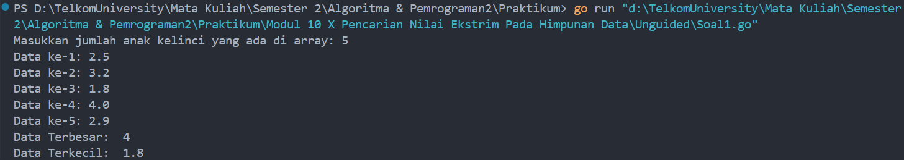
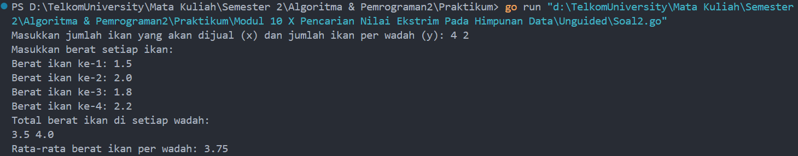
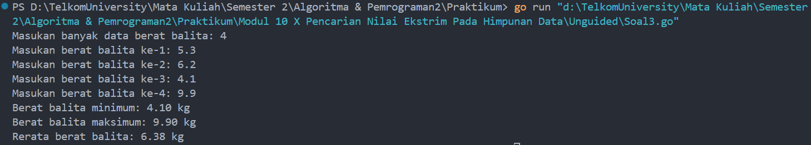

# <h1 align="center">Laporan Praktikum Modul 10 <br>  Pencarian Nilai Ekstrim Pada Himpunan Data </h1>
<p align="center">ABYAN RAHMAN AL FARIZ - 103112430021</p>

## Dasar Teori
___

Pencarian nilai ekstrim pada himpunan data adalah proses untuk menemukan nilai yang paling kecil (minimum) dan paling besar (maksimum) dalam suatu kumpulan data. Dalam konteks ini, nilai ekstrim dapat berupa elemen terkecil atau terbesar dalam sebuah array, list, atau struktur data lainnya. Proses ini umumnya dilakukan dengan membandingkan setiap elemen dalam himpunan data untuk menentukan apakah elemen tersebut lebih kecil dari nilai terkecil yang ditemukan sebelumnya atau lebih besar dari nilai terbesar yang ditemukan.

## Unguided
___
#### Soal 1

> Sebuah program digunakan untuk mendata berat anak kelinci yang akan dijual ke pasar. Program ini menggunakan array dengan kapasitas 1000 untuk menampung data berat anak kelinci yang akan dijual.

> Masukan terdiri dari sekumpulan bilangan, yang mana bilangan pertama adalah bilangan bulat N yang menyatakan banyaknya anak kelinci yang akan ditimbang beratnya. Selanjutnya N bilangan riil berikutnya adalah berat dari anak kelinci yang akan dijual.

> Keluaran terdiri dari dua buah bilangan riil yang menyatakan berat kelinci terkecil dan terbesar

```go
package main

import "fmt"  


type arrKelinci []float64

func main() {
    var n int
    var kelinci arrKelinci

    fmt.Print("Masukkan jumlah anak kelinci yang ada di array: ")
    fmt.Scan(&n)

    if n > 1000 {
        fmt.Println("Kapasitas maksimal adalah 1000 data")
        return
    }


    for i := 0; i < n; i++ {
        var berat float64
        fmt.Print("Data ke-", i+1, ": ")
        fmt.Scan(&berat)
        kelinci = append(kelinci, berat)
    }

    max := kelinci[0]
    min := kelinci[0]

    for i := 1; i < n; i++ {
        if kelinci[i] > max {
            max = kelinci[i]
        } else if kelinci[i] < min {
            min = kelinci[i]
        }
    }
  
    fmt.Println("Data Terbesar: ", max)
    fmt.Println("Data Terkecil: ", min)
    
}
```

> Output
> 
> 

### **Penjelasan Program:**

Program ini bertujuan untuk menghitung dan menampilkan berat anak kelinci terkecil dan terbesar yang dimasukkan oleh pengguna. Dimulai dengan meminta input jumlah data berat kelinci yang akan dimasukkan, program kemudian menggunakan array bertipe `float64` untuk menyimpan data tersebut. Program memastikan bahwa jumlah data tidak melebihi 1000, sesuai kapasitas maksimal yang ditentukan. Setelah itu, program akan meminta input berat kelinci satu per satu dari pengguna dan menyimpannya ke dalam array. Untuk mencari nilai ekstrim, program memulai dengan menetapkan elemen pertama sebagai nilai terkecil dan terbesar, kemudian melakukan perbandingan dengan setiap elemen lainnya untuk menemukan nilai terkecil dan terbesar dalam array. Setelah perhitungan selesai, program akan menampilkan nilai terbesar dan terkecil yang ditemukan. Dengan menggunakan pendekatan ini, program memberikan solusi yang efisien dalam menentukan batasan nilai dalam kumpulan data yang diberikan.

### **Kesimpulan:**

Program ini mengambil input sejumlah data berat anak kelinci, menyimpannya dalam array/slice, dan kemudian mencari serta menampilkan berat kelinci terbesar dan terkecil menggunakan perulangan dan perbandingan. Program ini juga menangani pengecekan kapasitas maksimal data (1000 data) dan memberikan feedback jika jumlah data yang dimasukkan melebihi kapasitas tersebut.
#### Soal 2

> Sebuah program digunakan untuk menentukan tarif ikan yang akan dijual ke pasar. Program ini menggunakan array dengan kapasitas 1000 untuk menampung data berat ikan yang akan dijual.

> Masukan terdiri dari dua baris, yang mana baris pertama terdiri dari dua bilangan bulat x dan y. Bilangan x menyatakan banyaknya ikan yang akan dijual, sedangkan y adalah banyaknya ikan yang akan dimasukan ke dalam wadah. Baris kedua terdiri dari sejumlah x bilangan riil yang menyatakan banyaknya ikan yang akan dijual.

> Keluaran terdiri dari dua baris. Baris pertama adalah kumpulan bilangan riil yang menyatakan total berat ikan di setiap wadah (jumlah wadah tergantung pada nilai x dan y, urutan ikan yang dimasukan ke dalam wadah sesuai urutan pada masukan baris ke-2). Baris kedua adalah sebuah bilangan riil yang menyatakan berat rata-rata ikan di setiap wadah.

```go
package main

import "fmt"


type arrIkan []float64

func main() {
    var x,y int
    var ikan arrIkan

    fmt.Print("Masukkan jumlah ikan yang akan dijual (x) dan jumlah ikan per wadah (y): ")
    fmt.Scan(&x, &y)

    if x > 1000 {
        fmt.Println("Kapasitas maksimal adalah 1000 data")
        return
    }

    fmt.Println("Masukkan berat setiap ikan: ")
    for i := 0; i < x; i++ {
        var berat float64
        fmt.Print("Berat ikan ke-", i+1, ": ")
        fmt.Scan(&berat)
        ikan = append(ikan, berat)
    }

    var totalWadah []float64
    var totalSemua, total float64
    var jumlahWadah int

    for i := 0; i < x; i += y {
        total = 0
        for j := i; j < i+y && j < x; j++ {
            total += ikan[j]
        }
        totalWadah = append(totalWadah, total)
        totalSemua += total
        jumlahWadah++
    }


    fmt.Println("Total berat ikan di setiap wadah:")
    for i := 0; i < len(totalWadah); i++ {
        fmt.Printf("%.1f ", totalWadah[i])
    }
    fmt.Println()

    rataRata := totalSemua / float64(jumlahWadah)

    fmt.Printf("Rata-rata berat ikan per wadah: %.2f\n", rataRata)

}
```

> Output
> 

### **Penjelasan Program:**

Program ini dirancang untuk menghitung total berat ikan yang dimasukkan ke dalam wadah serta menghitung rata-rata berat ikan per wadah. Pertama, pengguna diminta untuk memasukkan jumlah ikan yang akan dijual dan jumlah ikan yang akan dimasukkan ke setiap wadah. Kemudian, program meminta input berat ikan satu per satu dan menyimpannya dalam array. Setelah itu, program mengelompokkan ikan-ikan tersebut ke dalam wadah berdasarkan jumlah ikan per wadah yang ditentukan. Untuk setiap wadah, program menghitung total berat ikan, dan menghitung total berat ikan keseluruhan. Program juga menghitung rata-rata berat ikan per wadah dengan membagi total berat ikan seluruh wadah dengan jumlah wadah yang ada. Hasilnya kemudian ditampilkan dalam bentuk total berat ikan di setiap wadah dan rata-rata berat ikan per wadah. Program ini juga dilengkapi dengan pengecekan kapasitas maksimal, yaitu 1000 ikan, untuk memastikan bahwa data yang dimasukkan tidak melebihi batas yang ditentukan.

### **Kesimpulan:**

Program ini berfungsi untuk mengelompokkan ikan ke dalam wadah berdasarkan jumlah ikan per wadah yang diinginkan dan menghitung total berat ikan di setiap wadah serta rata-rata berat ikan per wadah. Program juga menangani pengecekan kapasitas maksimal 1000 ikan.

#### Soal 3

> Pos Pelayanan Terpadu (posyandu) sebagai tempat pelayanan kesehatan perlu mencatat data berat balita (dalam kg). Petugas akan memasukkan data tersebut ke dalam array. Dari data yang diperoleh akan dicari berat balita terkecil, terbesar, dan reratanya.

```go
package main

import "fmt"

  
type arrBalita []float64

func hitungMinMax(arrBerat arrBalita, bMin, bMax *float64) {
    *bMin = arrBerat[0]
    *bMax = arrBerat[0]

    for i := 1; i < len(arrBerat); i++ {
        if arrBerat[i] < *bMin {
            *bMin = arrBerat[i]
        }
        if arrBerat[i] > *bMax {
            *bMax = arrBerat[i]
        }
    }
}
  

func rerata(arrBerat arrBalita) float64 {
    var total float64
  
    for i := 0; i < len(arrBerat); i++ {
        total += arrBerat[i]
    }
    return total / float64(len(arrBerat))
}

  

func main() {
    var n int
    var array arrBalita
    var min, max float64
    var berat float64

    fmt.Print("Masukan banyak data berat balita: ")
    fmt.Scan(&n)

    if n > 100 {
        fmt.Println("Kapasitas maksimal adalah 100 data")
        return
    }

    for i := 0; i < n; i++ {
        fmt.Print("Masukan berat balita ke-", i+1, ": ")
        fmt.Scan(&berat)
        array = append(array, berat)
    }

  
    hitungMinMax(array, &min, &max)
    avg := rerata(array)

    fmt.Printf("Berat balita minimum: %.2f kg\n", min)
    fmt.Printf("Berat balita maksimum: %.2f kg\n", max)
    fmt.Printf("Rerata berat balita: %.2f kg\n", avg)
    
}
```

> Output
> 

### **Penjelasan Program:**

Program ini dirancang untuk menghitung dan menampilkan berat balita terkecil, terbesar, serta rata-rata dari data berat balita yang dimasukkan oleh pengguna. Pertama, program meminta input jumlah data berat balita dan memastikan jumlah data tidak melebihi kapasitas 100. Kemudian, program meminta pengguna untuk memasukkan berat masing-masing balita, yang kemudian disimpan dalam array. Fungsi `hitungMinMax` digunakan untuk mencari nilai terkecil dan terbesar dari array tersebut dengan membandingkan setiap elemen dalam array. Sementara itu, fungsi `rerata` menghitung rata-rata berat balita dengan menjumlahkan semua nilai dalam array dan membaginya dengan jumlah data yang ada. Setelah perhitungan selesai, program akan menampilkan hasilnya, yaitu berat balita minimum, maksimum, dan rerata dengan format dua angka desimal. Program ini juga mengontrol agar jumlah data tidak melebihi 100, sehingga dapat menghindari kesalahan input.

### **Kesimpulan:**

Program ini mengumpulkan data berat balita dari pengguna, kemudian menghitung nilai terkecil, terbesar, dan rata-rata berat balita dengan menggunakan dua fungsi utama: `hitungMinMax` untuk mencari nilai ekstrim dan `rerata` untuk menghitung rata-rata. Program ini juga mengontrol kapasitas data agar tidak melebihi 100 balita. Dengan program ini, kamu dapat dengan mudah mendapatkan informasi statistik terkait berat balita yang dimasukkan.

[^1]:


