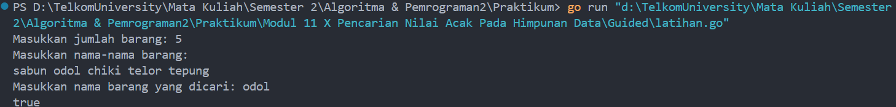
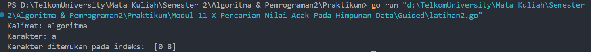
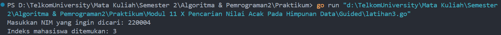
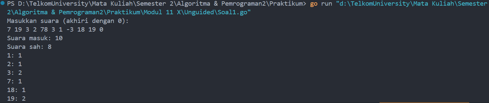
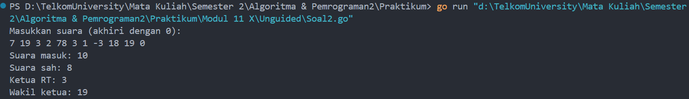
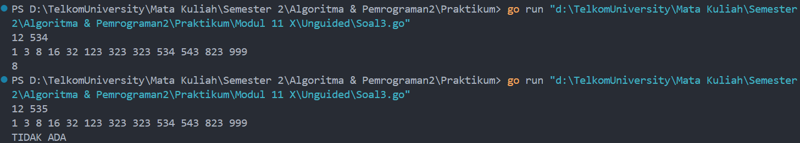

# <h1 align="center">Laporan Praktikum Modul 11 <br>  Pencarian Nilai Acak Pada Himpunan Data </h1>
<p align="center">ABYAN RAHMAN AL FARIZ - 103112430021</p>

## Dasar Teori
___

Pencarian nilai pada himpunan data adalah proses untuk menemukan data tertentu dalam kumpulan data. Ada dua metode utama yang sering digunakan, yaitu **pencarian sekuensial** dan **pencarian biner**. Pencarian sekuensial adalah metode yang digunakan untuk mencari elemen dalam data yang tidak terurut, dengan cara memeriksa setiap elemen satu per satu hingga data yang dicari ditemukan atau semua elemen telah diperiksa. Meskipun metode ini mudah digunakan, namun kurang efisien jika jumlah data sangat besar. Di sisi lain, pencarian biner hanya dapat digunakan pada data yang sudah terurut. Metode ini bekerja dengan membagi data menjadi dua bagian dan membandingkan nilai tengah dengan nilai yang dicari. **Pencarian nilai acak** digunakan untuk mencari elemen yang tidak diketahui posisinya dalam himpunan data.

## Guided
___
#### Soal 1

``` go
package main

import "fmt"

func cariBarang(daftar []string, x string) bool {
    for _, barang := range daftar {
        if barang == x {
            return true
        }
    }
    return false
}

  
func main() {
    var n int
    
    fmt.Print("Masukkan jumlah barang: ")
    fmt.Scan(&n)

    daftarBarang := make([]string, n)

    fmt.Println("Masukkan nama-nama barang:")

    for i := 0; i < n; i++ {

        fmt.Scan(&daftarBarang[i])

    }

    var barangDicari string
    
    fmt.Print("Masukkan nama barang yang dicari: ")
    fmt.Scan(&barangDicari)

    ditemukan := cariBarang(daftarBarang, barangDicari)
    fmt.Println(ditemukan)

}
```

> Output
> 

### **Penjelasan Program**

Program ini bertujuan untuk mencari apakah sebuah barang ada dalam daftar barang yang dimasukkan oleh pengguna. Di dalam program, pertama-tama pengguna diminta untuk memasukkan jumlah barang yang ingin dicatat. Setelah itu, program akan meminta pengguna untuk memasukkan nama-nama barang satu per satu dan menyimpannya dalam sebuah slice. Setelah daftar barang terisi, pengguna diminta untuk memasukkan nama barang yang ingin dicari. Fungsi `cariBarang` kemudian akan digunakan untuk mencari nama barang yang dicari dalam daftar. Fungsi ini melakukan pencarian linear, yaitu memeriksa setiap elemen dalam daftar barang satu per satu. Jika barang ditemukan, fungsi akan mengembalikan nilai `true`, dan jika tidak ditemukan, fungsi akan mengembalikan nilai `false`. Hasil pencarian, yaitu `true` atau `false`, akan dicetak di layar untuk memberi tahu pengguna apakah barang yang dicari ada dalam daftar atau tidak. Program ini menggunakan slice untuk menyimpan daftar barang dan menerapkan teknik pencarian sederhana menggunakan fungsi `cariBarang` untuk memeriksa keberadaan suatu barang.

### **Kesimpulan**

Program ini adalah implementasi sederhana dari pencarian linear untuk memeriksa apakah suatu item ada dalam daftar atau tidak. Program ini menggunakan slice untuk menyimpan daftar barang dan mengandalkan fungsi `cariBarang` untuk melakukan pencarian.


#### Soal 2

``` go
package main

import "fmt"

  
func pencarianHuruf(kalimat string, karakter string) [] int {
    var posisi [] int

    for i := 0; i < len(kalimat); i++ {
        if kalimat[i] == karakter[0] {
            posisi = append(posisi, i)
        }
    }
    return posisi
}


func main() {
    var kalimat, karakter string

    fmt.Print("Kalimat: ")
    fmt.Scan(&kalimat)
    fmt.Print("Karakter: ")
    fmt.Scan(&karakter)

    posisi := pencarianHuruf(kalimat, karakter)

    fmt.Println("Karakter ditemukan pada indeks: ", posisi)
}
```

> Output
> 

### **Penjelasan Program**

Program ini bertujuan untuk mencari posisi karakter dalam sebuah kalimat dan mengembalikan posisi indeks karakter tersebut. Fungsi utama dalam program ini adalah fungsi `pencarianHuruf`, yang menerima dua parameter: `kalimat` yang berisi teks yang akan diperiksa, dan `karakter` yang ingin dicari dalam kalimat tersebut. Fungsi ini melakukan iterasi terhadap setiap karakter dalam `kalimat` dan membandingkan karakter tersebut dengan karakter yang dicari. Jika ditemukan kecocokan, indeks posisi karakter tersebut akan disimpan dalam slice `posisi`. Setelah seluruh kalimat diperiksa, fungsi ini mengembalikan slice `posisi` yang berisi semua indeks tempat karakter yang dicari ditemukan. Di bagian `main`, program meminta pengguna untuk memasukkan kalimat dan karakter yang ingin dicari, kemudian memanggil fungsi `pencarianHuruf`. Hasilnya, yaitu indeks-indeks posisi karakter yang ditemukan, akan dicetak ke layar. Program ini akan mencetak posisi karakter yang dicari, atau jika karakter tidak ditemukan, maka akan mencetak slice kosong.

### **Kesimpulan**

program ini berfungsi untuk mencari dan menampilkan posisi indeks suatu karakter dalam sebuah kalimat. Dengan menggunakan fungsi `pencarianHuruf`, program memeriksa setiap karakter dalam kalimat dan mencatat indeks posisi karakter yang dicari. Jika karakter ditemukan, program akan mengembalikan posisi-posisi tersebut dalam bentuk daftar indeks. Program ini sederhana namun efektif dalam mencari karakter dalam kalimat dan memberikan hasil yang jelas berupa posisi karakter tersebut atau mencetak hasil kosong jika karakter tidak ditemukan.


#### Soal 3

``` go
package main

import (
    "fmt"
)

type Mahasiswa struct {
    nama string
    nim  string
}


func binarySearch(mahasiswa []Mahasiswa, x string) int {
    low := 0
    high := len(mahasiswa) - 1

    for low <= high {
        mid := (low + high) / 2
        if mahasiswa[mid].nim == x {
            return mid
        } else if mahasiswa[mid].nim < x {
            low = mid + 1
        } else {
            high = mid - 1
        }
    }
    return -1
}

  
func main() {
    mahasiswa := []Mahasiswa{
        {nama: "Andi", nim: "220001"},
        {nama: "Budi", nim: "220002"},
        {nama: "Citra", nim: "220003"},
        {nama: "Dina", nim: "220004"},
    }
    
    var x string
    
    fmt.Print("Masukkan NIM yang ingin dicari: ")
    fmt.Scanln(&x)

    index := binarySearch(mahasiswa, x)

    if index != -1 {
        fmt.Printf("Indeks mahasiswa ditemukan: %d\n", index)
    } else {
        fmt.Println("NIM tidak ditemukan.")
    }
}
```

> Output
> 

### **Penjelasan Program**

Program ini bertujuan untuk mencari data mahasiswa berdasarkan NIM menggunakan algoritma **Binary Search**. Program ini mendefinisikan struktur data `Mahasiswa`, yang memiliki dua atribut, yaitu `nama` dan `nim`. Fungsi `binarySearch` diimplementasikan untuk mencari NIM dalam daftar mahasiswa yang sudah terurut berdasarkan NIM. Algoritma Binary Search bekerja dengan membagi data menjadi dua bagian dan memeriksa nilai tengah. Jika nilai tengah lebih kecil dari nilai yang dicari, pencarian akan dilanjutkan pada bagian kanan; jika lebih besar, pencarian dilanjutkan pada bagian kiri. Fungsi ini akan mengembalikan indeks mahasiswa yang ditemukan jika NIM ditemukan, atau `-1` jika tidak ditemukan. Di dalam bagian `main`, program mendefinisikan data mahasiswa dalam slice yang sudah terurut berdasarkan NIM, meminta input NIM dari pengguna, dan memanggil fungsi `binarySearch` untuk mencari NIM tersebut dalam daftar. Jika NIM ditemukan, program akan mencetak indeks mahasiswa yang sesuai, atau mencetak pesan jika NIM tidak ditemukan. Program ini menggunakan **Binary Search**, yang efisien dengan kompleksitas waktu O(log n), sehingga cocok untuk pencarian data pada dataset besar yang sudah terurut.
### **Kesimpulan**

Program ini menggunakan **Binary Search** untuk mencari mahasiswa berdasarkan NIM dengan efisien. Program ini hanya berfungsi jika data mahasiswa sudah terurut berdasarkan NIM. Penggunaan Binary Search menjamin waktu pencarian yang cepat dengan kompleksitas O(log n), yang lebih efisien dibandingkan pencarian linier pada data yang besar.


## Unguided
___
#### Soal 1

> Pada pemilihan ketua RT yang baru saja berlangsung, terdapat 20 calon ketua yang bertanding memperebutkan suara warga. Perhitungan suara dapat segera dilakukan karena warga cukup mengisi formulir dengan nomor dari calon ketua RT yang dipilihnya. Seperti biasa, selalu ada pengisian yang tidak tepat atau dengan nomor pilihan di luar yang tersedia, sehingga data juga harus divalidasi. Tugas Anda untuk membuat program mencari siapa yang memenangkan pemilihan ketua RT. Buatlah program pilkart yang akan membaca, memvalidasi, dan menghitung suara yang diberikan dalam pemilihan ketua RT tersebut.

> Masukan hanya satu baris data saja, berisi bilangan bulat valid yang kadang tersisipi dengan data tidak valid. Data valid adalah integer dengan nilai di antara 1 s.d. 20 (inklusif). Data berakhir jika ditemukan sebuah bilangan dengan nilai 0.

> Keluaran dimulai dengan baris berisi jumlah data suara yang terbaca, diikuti baris yang berisi berapa banyak suara yang valid. Kemudian sejumlah baris yang mencetak data para calon apa saja yang mendapatkan suara.

```go
package main

import "fmt"

  
func main() {
    const maxCalon = 20
    var suara int
    var totalMasuk, totalSah int
    var perolehan [maxCalon + 1]int
    var input [100]int

    fmt.Println("Masukkan suara (akhiri dengan 0):")

    i := 0
    for {
        fmt.Scan(&suara)
        if suara == 0 {
            break
        }
        input[i] = suara
        i++
    }

    totalMasuk = i

    j := 0
    for j < totalMasuk {
        s := input[j]
        if s >= 1 && s <= maxCalon {
            perolehan[s]++
            totalSah++
        }
        j++
    }

    fmt.Printf("Suara masuk: %d\n", totalMasuk)
    fmt.Printf("Suara sah: %d\n", totalSah)

    k := 1
    for k <= maxCalon {
        if perolehan[k] > 0 {
            fmt.Printf("%d: %d\n", k, perolehan[k])
        }
        k++
    }
}
```

> Output
> 
> 

### **Penjelasan Program:**

Program ini dirancang untuk menghitung jumlah suara yang masuk, jumlah suara yang sah, dan menampilkan perolehan suara setiap calon dalam pemilihan ketua RT. Pertama, program meminta pengguna untuk memasukkan suara, yang akan terus berlanjut hingga angka 0 dimasukkan, menandakan akhir input. Program kemudian memeriksa setiap suara yang dimasukkan, dan jika suara tersebut valid (bernilai antara 1 hingga 20), maka suara tersebut dianggap sah dan akan dihitung. Program mencatat perolehan suara untuk setiap calon menggunakan array `perolehan`. Setelah itu, program mencetak total suara yang masuk, jumlah suara yang sah, dan jumlah suara yang diterima oleh setiap calon. Dengan cara ini, program memberikan informasi yang jelas tentang hasil pemilihan berdasarkan suara yang diterima oleh setiap calon.

### **Kesimpulan:**

Program ini efektif untuk menghitung jumlah suara yang masuk dan yang sah dalam pemilihan ketua RT. Dengan menggunakan array `perolehan`, program dapat dengan mudah menampilkan jumlah suara untuk setiap calon. Program ini cukup sederhana namun berguna untuk melakukan penghitungan suara dalam suatu pemilihan.

#### Soal 2

> Berdasarkan program sebelumnya, buat program pilkart yang mencari siapa pemenang pemilihan ketua RT. Sekaligus juga ditentukan bahwa wakil ketua RT adalah calon yang mendapatkan suara terbanyak kedua. Jika beberapa calon mendapatkan suara terbanyak yang  sama, ketua terpilih adalah dengan nomor peserta yang paling kecil dan wakilnya dengan nomor peserta terkecil berikutnya.

> Masukan hanya satu baris data saja, berisi bilangan bulat valid yang kadang tersisipi dengan data tidak valid. Data valid adalah bilangan bulat dengan nilai di antara 1 s.d. 20 (inklusif). Data berakhir jika ditemukan sebuah bilangan dengan nilai 0.

> Keluaran dimulai dengan baris berisi jumlah data suara yang terbaca, diikuti baris yang berisi berapa banyak suara yang valid. Kemudian tercetak calon nomor berapa saja yang menjadi pasangan ketua RT dan wakil ketua RT yang baru.

```go
package main

import "fmt"


func main() {
    const maxCalon = 20
    var suara int
    var totalMasuk, totalSah int
    var perolehan [maxCalon + 1]int
    var input [100]int

    fmt.Println("Masukkan suara (akhiri dengan 0):")
    
    i := 0
    for {
        fmt.Scan(&suara)
        if suara == 0 {
            break
        }
        input[i] = suara
        i++
    }

    totalMasuk = i  

    j := 0
    for j < totalMasuk {
        s := input[j]
        if s >= 1 && s <= maxCalon {
            perolehan[s]++
            totalSah++
        }
        j++
    }

    fmt.Printf("Suara masuk: %d\n", totalMasuk)
    fmt.Printf("Suara sah: %d\n", totalSah)

    var max1, max2 int
    var ketua, wakil int

    for k := 1; k <= maxCalon; k++ {
        if perolehan[k] > max1 {
            max2 = max1
            wakil = ketua
            max1 = perolehan[k]
            ketua = k
        } else if perolehan[k] > max2 {
            max2 = perolehan[k]
            wakil = k
        }
    }


    fmt.Printf("Ketua RT: %d\n", ketua)
    fmt.Printf("Wakil ketua: %d\n", wakil)
}
```

> Output
> 

### **Penjelasan Program:**

Program ini bertujuan untuk menghitung suara yang masuk, menentukan jumlah suara sah, serta mencari calon ketua dan wakil ketua RT berdasarkan perolehan suara terbanyak. Pertama, program meminta input suara dari pengguna yang berisi nomor calon ketua RT, diakhiri dengan angka 0. Program kemudian memeriksa setiap suara yang valid (angka antara 1 hingga 20), menghitung total suara yang masuk, dan mencatat suara sah dalam array `perolehan`. Setelah itu, program mencari calon ketua dan wakil ketua berdasarkan suara terbanyak. Jika ada beberapa calon dengan jumlah suara terbanyak yang sama, ketua terpilih adalah calon dengan nomor terkecil, dan wakil ketua adalah calon dengan nomor terkecil berikutnya. Program kemudian mencetak hasil pemilihan, termasuk jumlah suara yang masuk, jumlah suara sah, serta nomor calon yang terpilih sebagai ketua dan wakil ketua RT.

### **Kesimpulan:**

Secara keseluruhan, program ini efektif untuk mengelola perhitungan suara dalam pemilihan ketua RT dan wakil ketua RT, memberikan hasil yang jelas berdasarkan jumlah suara yang diterima setiap calon.


#### Soal 3

> Diberikan n data integer positif dalam keadaan terurut membesar dan sebuah integer lain k, apakah bilangan k tersebut ada dalam daftar bilangan yang diberikan? Jika ya, berikan indeksnya, jika tidak sebutkan "TIDAK ADA".

> Masukan terdiri dari dua baris. Baris pertama berisi dua buah integer positif, yaitu n dan k. n menyatakan banyaknya data, dimana 1 < n <= 1000000. k adalah bilangan yang ingin dicari. Baris kedua berisi n buah data integer positif yang sudah terurut membesar.

> Keluaran terdiri dari satu baris saja, yaitu sebuah bilangan yang menyatakan posisi data yang dicari (k) dalam kumpulan data yang diberikan. Posisi data dihitung dimulai dari angka 0. Atau memberikan keluaran "TIDAK ADA" jika data k tersebut tidak ditemukan dalam kumpulan.

```go
package main

import "fmt"  

const NMAX = 1000000
var data [NMAX]int


func isiArray(n int) {
    for i := 0; i < n; i++ {
        fmt.Scan(&data[i])
    }
}

  
func posisi(n, k int) int {
    low := 0
    high := n - 1

    for low <= high {
        mid := (low + high) / 2
        if data[mid] == k {
            return mid
        } else if data[mid] < k {
            low = mid + 1
        } else {
            high = mid - 1
        }
    }
    return -1
}
  

func main() {

    var n, k int

    fmt.Scan(&n, &k)
    isiArray(n)

    pos := posisi(n, k)
  
    if pos == -1 {
        fmt.Println("TIDAK ADA")
    } else {
        fmt.Println(pos)
    }
}
```

> Output
> 

### **Penjelasan Program:**

Program ini bertujuan untuk mencari posisi suatu angka dalam sebuah array yang sudah terurut menggunakan algoritma **Binary Search**. Dalam program ini, pertama-tama pengguna diminta untuk memasukkan jumlah elemen dalam array (`n`) dan angka yang ingin dicari (`k`). Setelah itu, array `data` diisi dengan `n` elemen yang dimasukkan oleh pengguna. Fungsi `posisi` kemudian menggunakan algoritma **Binary Search** untuk mencari posisi angka `k` dalam array yang sudah terurut. Algoritma ini bekerja dengan cara membagi array menjadi dua bagian berdasarkan nilai tengah dan memeriksa apakah nilai tengah lebih kecil, lebih besar, atau sama dengan angka yang dicari. Jika ditemukan, fungsi ini mengembalikan indeks posisi angka tersebut; jika tidak, fungsi mengembalikan `-1`, yang berarti angka tidak ditemukan. Program akan mencetak posisi indeks jika angka ditemukan, atau mencetak "TIDAK ADA" jika angka tidak ditemukan dalam array.

### **Kesimpulan:**

Program ini menggunakan **Binary Search** untuk mencari posisi suatu angka dalam array yang sudah terurut. Dengan menggunakan binary search, program dapat melakukan pencarian dengan waktu yang efisien, yaitu O(log n). Program ini sangat berguna ketika mencari data dalam dataset besar yang sudah terurut, mengurangi jumlah elemen yang perlu diperiksa dibandingkan dengan pencarian linier.

[^1]:


