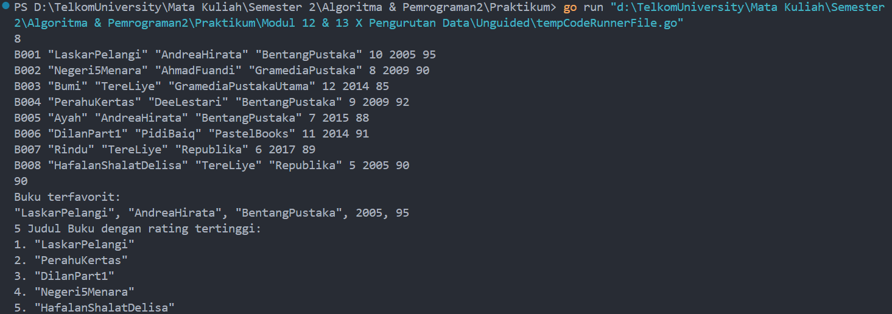

# <h1 align="center">Laporan Praktikum Modul 11 <br>  Pencarian Nilai Acak Pada Himpunan Data </h1>
<p align="center">ABYAN RAHMAN AL FARIZ - 103112430021</p>

## Dasar Teori
___

Pengurutan data (sorting) merupakan salah satu proses dasar dalam ilmu komputer yang bertujuan untuk menyusun elemen-elemen data dalam urutan tertentu, seperti urutan menaik (ascending) atau menurun (descending). 

**Selection sort** adalah algoritma pengurutan yang bekerja dengan cara mencari elemen terkecil (atau terbesar, tergantung urutan yang diinginkan) dari kumpulan data yang belum terurut, kemudian menempatkannya pada posisi yang sesuai di bagian depan. Proses ini diulang hingga seluruh data terurut.

**Insertion sort** adalah algoritma yang menyusun data dengan cara membandingkan setiap elemen dengan elemen-elemen sebelumnya yang sudah terurut, lalu menyisipkannya ke posisi yang sesuai. Proses ini mirip dengan cara seseorang menyusun kartu secara manual.

## Guided
___
#### Soal 1

``` go
package main

import "fmt"


func sorting(arr []int) []int {
    ganjil := []int{}
    genap := []int{}

    for i := 0; i < len(arr); i++ {
        if arr[i]%2 == 0 {
            genap = append(genap, arr[i])
        } else {
            ganjil = append(ganjil, arr[i])
        }
    }

    for i := 0; i < len(ganjil)-1; i++ {
        for j := i + 1; j < len(ganjil); j++ {
            if ganjil[j] < ganjil[i] {
                ganjil[i], ganjil[j] = ganjil[j], ganjil[i]
            }
        }
    }

    for i := 0; i < len(genap)-1; i++ {
        for j := i + 1; j < len(genap); j++ {
            if genap[j] > genap[i] {
                genap[i], genap[j] = genap[j], genap[i]
            }
        }
    }
    return append(ganjil, genap...)
}

  
func main() {
    angka := []int{12, 7, 3, 2, 9, 6, 8, 1, 11, 4}
    angkaTerurut := sorting(angka)
    fmt.Println(angkaTerurut)
}
```

> Output
> 

### **Penjelasan Program**

Program ini bertujuan untuk mengurutkan sebuah array integer berdasarkan jenis bilangan, yaitu ganjil dan genap, lalu menggabungkannya kembali dengan urutan tertentu. Pada bagian awal program, fungsi `sorting` menerima parameter berupa slice integer. Fungsi ini pertama-tama memisahkan data ke dalam dua slice terpisah, yaitu `ganjil` untuk bilangan ganjil dan `genap` untuk bilangan genap. Pemisahan dilakukan dengan melakukan iterasi terhadap elemen dalam array dan memeriksa apakah elemen tersebut habis dibagi dua. Setelah bilangan berhasil dikelompokkan, program kemudian mengurutkan slice `ganjil` secara menaik (ascending) dan `genap` secara menurun (descending). Pengurutan dilakukan menggunakan nested loop manual, mirip dengan metode selection sort. Setelah kedua kelompok terurut, slice `ganjil` dan `genap` digabungkan kembali dengan `append`, dengan urutan ganjil lebih dahulu, baru kemudian genap. Hasil akhir dari fungsi ini adalah slice baru yang berisi bilangan ganjil terurut naik diikuti bilangan genap terurut turun. Fungsi ini kemudian dipanggil dalam fungsi `main`, yang akan mencetak hasilnya ke layar.

### **Kesimpulan**

Program ini merupakan implementasi sederhana dari algoritma pemisahan dan pengurutan berbasis kondisi (ganjil-genap). Dengan menggunakan pendekatan manual (nested loop), program berhasil mengurutkan dua kelompok bilangan dalam arah yang berbeda, lalu menggabungkannya sesuai urutan yang diinginkan. Program ini memperlihatkan pemahaman dasar tentang manipulasi slice, pengurutan tanpa fungsi bawaan, serta penggunaan logika pemisahan data.

#### Soal 2

``` go
package main

import "fmt"


type Mahasiswa struct {
    NIM   string
    Nilai int
}

  
func urutkan(arr []Mahasiswa) {
    for i := 1; i < len(arr); i++ {
        kunci := arr[i]
        j := i - 1
        
        for j >= 0 && arr[j].Nilai < kunci.Nilai {
            arr[j+1] = arr[j]
            j = j - 1
        }
        arr[j+1] = kunci
    }
}

  
func main() {
    mahasiswa := []Mahasiswa{
        {"12345", 75},
        {"67890", 60},
        {"11223", 90},
        {"44556", 80},
        {"78901", 100},
        {"22334", 65},
    }

    urutkan(mahasiswa)

    for i := 0; i < len(mahasiswa); i++ {
        fmt.Print(mahasiswa[i].Nilai, " ")
    }
}
```

> Output
> 

### **Penjelasan Program**

Program ini bertujuan untuk mengurutkan data mahasiswa berdasarkan nilai mereka secara menurun (dari yang tertinggi ke yang terendah) menggunakan algoritma _insertion sort_. Struktur data `Mahasiswa` didefinisikan menggunakan `struct`, yang terdiri dari dua field: `NIM` bertipe string sebagai identitas mahasiswa, dan `Nilai` bertipe integer sebagai skor atau nilai mereka. Pada fungsi `main`, slice `mahasiswa` diisi dengan data enam mahasiswa yang masing-masing memiliki NIM dan nilai.

Pengurutan dilakukan dalam fungsi `urutkan`, yang menerima slice dari struct `Mahasiswa` sebagai parameter. Fungsi ini menerapkan logika insertion sort manual, dimulai dari elemen indeks ke-1 hingga akhir slice. Pada setiap iterasi, elemen `arr[i]` disimpan dalam variabel `kunci`, lalu dibandingkan dengan elemen-elemen sebelumnya (`arr[j]`) satu per satu. Jika ditemukan elemen dengan nilai lebih kecil dari `kunci`, maka elemen tersebut digeser ke kanan. Proses ini terus berlanjut hingga ditemukan posisi yang tepat untuk menyisipkan elemen `kunci` sehingga urutan tetap dalam kondisi menurun. Hal ini dilakukan dengan cara menggeser elemen dan menyisipkan `kunci` pada indeks `j+1`.

Setelah pengurutan selesai, fungsi `main` mencetak nilai mahasiswa secara berurutan dari yang terbesar ke yang terkecil dengan menggunakan perulangan `for` berdasarkan indeks slice.

### **Kesimpulan**

Program ini menunjukkan implementasi sederhana dan efektif dari algoritma _insertion sort_ untuk mengurutkan slice berisi data struct. Dengan pengurutan berdasarkan field `Nilai` secara menurun, program ini memperlihatkan bagaimana sorting bisa diterapkan pada data yang lebih kompleks dari sekadar angka biasa.


## Unguided
___
### Soal Selection Sort
___

#### Soal 1

> Hercules, preman terkenal seantero ibukota, memiliki kerabat di banyak daerah. Tentunya Hercules sangat suka mengunjungi semua kerabatnya itu. Diberikan masukan nomor rumah dari semua kerabatnya di suatu daerah, buatlah program rumahkerabat yang akan menyusun nomor-nomor rumah kerabatnya secara terurut membesar menggunakan algoritma selection sort.

> Masukan dimulai dengan sebuah integer n (0 < n < 1000), banyaknya daerah kerabat Hercules tinggal. Isi n baris berikutnya selalu dimulai dengan sebuah integer m (0 < m < 1000000) yang menyatakan banyaknya rumah kerabat di daerah tersebut, diikuti dengan rangkaian bilangan bulat positif, nomor rumah para kerabat.

> Keluaran terdiri dari n baris, yaitu rangkaian rumah kerabatnya terurut membesar di masingmasing daerah.

```go
package main

import "fmt"

  
func main() {
    const maxCalon = 20
    var suara int
    var totalMasuk, totalSah int
    var perolehan [maxCalon + 1]int
    var input [100]int

    fmt.Println("Masukkan suara (akhiri dengan 0):")

    i := 0
    for {
        fmt.Scan(&suara)
        if suara == 0 {
            break
        }
        input[i] = suara
        i++
    }

    totalMasuk = i

    j := 0
    for j < totalMasuk {
        s := input[j]
        if s >= 1 && s <= maxCalon {
            perolehan[s]++
            totalSah++
        }
        j++
    }

    fmt.Printf("Suara masuk: %d\n", totalMasuk)
    fmt.Printf("Suara sah: %d\n", totalSah)

    k := 1
    for k <= maxCalon {
        if perolehan[k] > 0 {
            fmt.Printf("%d: %d\n", k, perolehan[k])
        }
        k++
    }
}
```

> Output
> 
> 

### **Penjelasan Program:**

Program ini dirancang untuk mengurutkan nomor rumah dari beberapa daerah menggunakan algoritma _selection sort_. Pada awal program, pengguna diminta memasukkan sebuah bilangan bulat `n` yang menyatakan jumlah daerah yang memiliki data nomor rumah. Untuk setiap daerah, pengguna kembali diminta memasukkan bilangan `m` yang menunjukkan jumlah rumah di daerah tersebut, diikuti dengan `m` buah bilangan bulat positif yang mewakili nomor rumah dari kerabat Hercules di daerah tersebut.

Semua nomor rumah dari satu daerah disimpan dalam slice `rumah`, lalu slice tersebut diurutkan menggunakan fungsi `selectionSort`. Fungsi ini bekerja dengan memilih elemen terkecil dari bagian slice yang belum terurut, kemudian menukarnya dengan elemen di posisi paling awal dari bagian tersebut. Proses ini diulang hingga seluruh elemen berada dalam urutan menaik. Setelah data terurut, hasilnya disimpan dalam `rumahTerurut` dan kemudian dicetak ke layar dengan spasi sebagai pemisah antar elemen, serta satu baris per daerah.

### **Kesimpulan:**

Program ini merupakan implementasi dari algoritma _selection sort_ untuk menyelesaikan kasus pengurutan nomor rumah di beberapa daerah. Dengan pendekatan yang sederhana dan logika iteratif, program berhasil menyusun setiap kumpulan data menjadi urutan menaik.

#### Soal 2

> Belakangan diketahui ternyata Hercules itu tidak berani menyeberang jalan, maka selalu diusahakan agar hanya menyeberang jalan sesedikit mungkin, hanya diujung jalan. Karena nomor rumah sisi kiri jalan selalu ganjil dan sisi kanan jalan selalu genap, maka buatlah program kerabat dekat yang akan menampilkan nomor rumah mulai dari nomor yang ganjil lebih dulu terurut membesar dan kemudian menampilkan nomor rumah dengan nomor genap terurut mengecil.

> Format Masukan masih persis sama seperti sebelumnya.

> Keluaran terdiri dari n baris, yaitu rangkaian rumah kerabatnya terurut membesar untuk nomor ganjil, diikuti dengan terurut mengecil untuk nomor genap, di masing-masing daerah.

> Keterangan: Terdapat 3 daerah dalam contoh masukan. Baris kedua berisi campuran bilangan ganjil dan genap. Baris berikutnya hanya berisi bilangan ganjil, dan baris terakhir hanya berisi bilangan genap.

```go
package main

import "fmt"

  
func selectionSortAsc(arr []int) {
    var i, j, minIdx, temp int

    for i = 0; i < len(arr)-1; i++ {
        minIdx = i
        for j = i + 1; j < len(arr); j++ {
            if arr[j] < arr[minIdx] {
                minIdx = j
            }
        }
        temp = arr[i]
        arr[i] = arr[minIdx]
        arr[minIdx] = temp
    }
}

  
func selectionSortDesc(arr []int) {
    var i, j, maxIdx, temp int

    for i = 0; i < len(arr)-1; i++ {
        maxIdx = i
        for j = i + 1; j < len(arr); j++ {
            if arr[j] > arr[maxIdx] {
                maxIdx = j
            }
        }
        temp = arr[i]
        arr[i] = arr[maxIdx]
        arr[maxIdx] = temp
    }
}

  
func prosesDaerah(m int) []int {
    var i int
    var rumah []int = make([]int, m)
    var ganjil, genap []int

    for i = 0; i < m; i++ {
        fmt.Scan(&rumah[i])
    }

    for i = 0; i < m; i++ {
        if rumah[i]%2 == 1 {
            ganjil = append(ganjil, rumah[i])
        } else {
            genap = append(genap, rumah[i])
        }
    }

    selectionSortAsc(ganjil)
    selectionSortDesc(genap)
  
    var hasil []int = append(ganjil, genap...)
    return hasil
}


func cetakHasil(hasil [][]int) {
    var i, j int

    for i = 0; i < len(hasil); i++ {
        for j = 0; j < len(hasil[i]); j++ {
            fmt.Print(hasil[i][j], " ")
        }
        fmt.Println()
    }
}

  
func main() {
    var n, i, m int
    var hasil [][]int
  
    fmt.Scan(&n)
  
    for i = 0; i < n; i++ {
        fmt.Scan(&m)
        hasil = append(hasil, prosesDaerah(m))
    }
    cetakHasil(hasil)
}
```

> Output
> 

### **Penjelasan Program:**

Program ini dibuat untuk memproses data nomor rumah dari beberapa daerah, kemudian mengurutkannya berdasarkan aturan tertentu. Setiap nomor rumah yang ganjil akan diurutkan secara menaik (ascending), sementara yang genap akan diurutkan secara menurun (descending). Pengguna pertama-tama diminta memasukkan sebuah bilangan bulat `n` yang menunjukkan jumlah daerah. Untuk setiap daerah, diminta kembali memasukkan jumlah rumah `m` dan diikuti oleh `m` buah nomor rumah.

Fungsi `prosesDaerah` digunakan untuk memproses setiap daerah. Di dalam fungsi ini, nomor-nomor rumah dibaca dan dikelompokkan ke dalam dua slice, yaitu `ganjil` dan `genap`, tergantung dari hasil sisa pembagian dua. Setelah pengelompokan, slice `ganjil` diurutkan menggunakan fungsi `selectionSortAsc`, sedangkan `genap` diurutkan menggunakan `selectionSortDesc`. Kedua fungsi tersebut menerapkan algoritma selection sort secara manual, yang menukar elemen terkecil atau terbesar ke posisi yang sesuai secara bertahap menggunakan nested loop dan variabel indeks.

Setelah kedua kelompok terurut, keduanya digabung kembali menjadi satu slice dengan urutan ganjil dulu lalu genap, dan dikembalikan sebagai hasil akhir untuk satu daerah. Hasil dari semua daerah kemudian dikumpulkan dalam slice dua dimensi `hasil`. Fungsi `cetakHasil` kemudian dipanggil untuk mencetak setiap hasil per daerah dalam satu baris, memisahkan nomor-nomor rumah dengan spasi.

### **Kesimpulan:**

Program ini menggabungkan teknik pengelompokan berdasarkan kondisi bilangan (ganjil/genap) dan pengurutan dengan algoritma selection sort untuk menyusun data dalam urutan tertentu.


#### Soal 3

> Kompetisi pemrograman yang baru saja berlalu diikuti oleh 17 tim dari berbagai perguruan tinggi ternama. Dalam kompetisi tersebut, setiap tim berlomba untuk menyelesaikan sebanyak mungkin problem yang diberikan. Dari 13 problem yang diberikan, ada satu problem yang menarik. Problem tersebut mudah dipahami, hampir semua tim mencoba untuk menyelesaikannya, tetapi hanya 3 tim yang berhasil. Apa sih problemnya?

> Masukan berbentuk rangkaian bilangan bulat. Masukan tidak akan berisi lebih dari 1000000 data, tidak termasuk bilangan 0. Data 0 merupakan tanda bahwa median harus dicetak, tidak termasuk data yang dicari mediannya. Data masukan diakhiri dengan bilangan bulat -5313.

> Keluaran adalah median yang diminta, satu data per baris.
 
> Keterangan: Sampai bilangan 0 yang pertama, data terbaca adalah 7 23 11, setelah tersusun: 7 11 23, maka median saat itu adalah 11. Sampai bilangan 0 yang kedua, data adalah 7 23 11 5 19 2 29 3 13 17, setelah tersusun diperoleh: 2 3 5 7 11 13 17 19 23 29. Karena ada 10 data, genap, maka median adalah (11+13)/2=12.

```go
package main

import "fmt"

  
func selectionSort(arr []int) {
    var i, j, minIdx, temp int

    for i = 0; i < len(arr)-1; i++ {
        minIdx = i
        for j = i + 1; j < len(arr); j++ {
            if arr[j] < arr[minIdx] {
                minIdx = j
            }
        }
        temp = arr[i]
        arr[i] = arr[minIdx]
        arr[minIdx] = temp
    }
}

  
func hitungMedian(data []int) int {
    var n, tengah, median int

    n = len(data)

    selectionSort(data)

    if n%2 == 1 {
        tengah = n / 2
        median = data[tengah]
    } else {
        tengah = n / 2
        median = (data[tengah-1] + data[tengah]) / 2
    }
    return median
}

  
func main() {
    var input int
    var data []int
    var salinan []int
    var hasil int

    for {
        fmt.Scan(&input)
        
        if input == -5313 {
            break
        } else if input == 0 {
            if len(data) > 0 {
                salinan = make([]int, len(data))
                copy(salinan, data)
                hasil = hitungMedian(salinan)
                fmt.Println(hasil)
            }
        } else {
            data = append(data, input)
        }
    }
}
```

> Output
> 

### **Penjelasan Program:**

Program ini bertujuan untuk menghitung **median** dari sekumpulan bilangan bulat positif yang dimasukkan oleh pengguna. Proses penghitungan median dilakukan setiap kali pengguna memasukkan angka `0`, sementara angka `-5313` digunakan sebagai tanda akhir masukan. Di antara dua angka kontrol ini (`0` dan `-5313`), semua angka positif yang dibaca akan disimpan ke dalam slice `data`. Ketika angka `0` terbaca, program akan menghitung median dari data yang telah terkumpul sejauh itu dan mencetak hasilnya ke layar.

Penghitungan median dilakukan melalui fungsi `hitungMedian`, yang menerima parameter berupa slice integer. Di dalam fungsi tersebut, data terlebih dahulu diurutkan menggunakan algoritma **selection sort manual** melalui fungsi `selectionSort`. Proses pengurutan dilakukan dengan cara mencari elemen terkecil dari bagian yang belum terurut, lalu menukarnya ke posisi yang tepat. Setelah data terurut, median ditentukan berdasarkan jumlah elemen dalam slice: jika jumlahnya ganjil, median adalah elemen tengah; jika genap, median dihitung dari rata-rata dua elemen tengah, dan dibulatkan ke bawah secara otomatis karena menggunakan tipe data integer. Untuk menghindari pengubahan data asli, program membuat **salinan** slice `data` sebelum melakukan proses pengurutan, agar data yang asli tetap bisa digunakan kembali untuk perhitungan berikutnya jika diperlukan.

### **Kesimpulan:**

Program ini merupakan implementasi logika dasar pengolahan data dengan teknik pengurutan dan penghitungan nilai tengah. Dengan menggunakan metode selection sort manual dan pemisahan logika penghitungan median dalam fungsi terpisah, program ini mencerminkan pemahaman struktur algoritma yang rapi dan modular. Penggunaan slice salinan memastikan integritas data utama tetap terjaga, sementara perintah-perintah kontrol seperti `0` dan `-5313` membuat alur input menjadi fleksibel dan terstruktur.


___
### Soal Insertion Sort
___

#### Soal 1

> Buatlah sebuah program yang digunakan untuk membaca data integer seperti contoh yang diberikan di bawah ini, kemudian diurutkan (menggunakan metoda insertion sort), dan memeriksa apakah data yang terurut berjarak sama terhadap data sebelumnya.

> Masukan terdiri dari sekumpulan bilangan bulat yang diakhiri oleh bilangan negatif. Hanya bilangan non negatif saja yang disimpan ke dalam array.

> Keluaran terdiri dari dua baris. Baris pertama adalah isi dari array setelah dilakukan pengurutan, sedangkan baris kedua adalah status jarak setiap bilangan yang ada di dalam array. "Data berjarak x" atau "data berjarak tidak tetap".
 
``` go
package main

import "fmt"

  
func insertionSort(arr []int) []int {
    for i := 1; i < len(arr); i++ {
        temp := arr[i]
        j := i
        for j > 0 && temp < arr[j-1] {
            arr[j] = arr[j-1]
            j = j - 1
        }
        arr[j] = temp
    }
    return arr
}

  
func jarakTetap(arr []int) (bool, int) {
    if len(arr) < 2 {
        return true, 0
    }
    selisih := arr[1] - arr[0]
    for i := 2; i < len(arr); i++ {
        if arr[i]-arr[i-1] != selisih {
            return false, 0
        }
    }
    return true, selisih
}

  
func main() {
    data := []int{}
    var x int
  
    for {
        fmt.Scan(&x)
        if x < 0 {
            break
        }
        data = append(data, x)
    }

    data = insertionSort(data)  

    for i := 0; i < len(data); i++ {
        fmt.Print(data[i])
        if i != len(data)-1 {
            fmt.Print(" ")
        }
    }
    fmt.Println()

    tetap, jarak := jarakTetap(data)
    
    if tetap {
        fmt.Println("Data berjarak", jarak)
    } else {
        fmt.Println("Data berjarak tidak tetap")
    }
}
```

> Output
> 


### **Penjelasan Program:**

Program ini dirancang untuk membaca sekumpulan bilangan bulat dari pengguna, kemudian mengurutkannya menggunakan algoritma _insertion sort_, serta memeriksa apakah data tersebut memiliki **jarak yang tetap** antara elemen-elemen yang sudah terurut. Proses dimulai dengan membaca masukan angka dari pengguna secara berulang-ulang hingga pengguna memasukkan angka negatif. Semua angka non-negatif disimpan dalam slice `data`, sementara angka negatif digunakan sebagai penanda akhir masukan.

Setelah seluruh data dibaca, program memanggil fungsi `insertionSort` untuk mengurutkan slice `data` secara menaik. Algoritma insertion sort bekerja dengan cara mengambil satu elemen pada satu waktu (dimulai dari indeks ke-1), dan membandingkannya ke belakang hingga menemukan posisi yang tepat untuk disisipkan. Jika elemen yang sedang dibandingkan lebih besar, maka elemen sebelumnya digeser ke kanan. Proses ini diulang untuk seluruh elemen sehingga hasil akhir adalah slice yang terurut secara ascending.

Setelah data terurut, program akan mencetak seluruh elemen yang telah disusun. Selanjutnya, fungsi `jarakTetap` digunakan untuk memeriksa apakah data yang terurut memiliki **selisih yang sama (jarak tetap)** antar elemen yang berurutan. Fungsi ini membandingkan selisih antara elemen pertama dan kedua, lalu memverifikasi apakah selisih tersebut sama untuk seluruh pasang elemen berikutnya. Jika ya, maka akan dicetak pesan “Data berjarak x”, di mana `x` adalah nilai selisih tersebut. Jika tidak, maka akan ditampilkan “Data berjarak tidak tetap”.

### **Kesimpulan:**

Program ini menunjukkan implementasi gabungan dari algoritma pengurutan (_insertion sort_) dan pemeriksaan pola jarak antar data.


#### Soal 2

> Sebuah program perpustakaan digunakan untuk mengelola data buku di dalam suatu perpustakaan. Misalnya terdefinisi struct dan array seperti berikut ini: 
```
const nMax : integer = 7919 
type Buku = < 
	id, judul, penulis, penerbit : string 
	eksemplar, tahun, rating : integer > 

type DaftarBuku = array [ 1..nMax] of Buku 
Pustaka : DaftarBuku 
nPustaka: integer
```

> Masukan terdiri dari beberapa baris. Baris pertama adalah bilangan bulat N yang menyatakan banyaknya data buku yang ada di dalam perpustakaan. N baris berikutnya, masing-masingnya adalah data buku sesuai dengan atribut atau field pada struct. Baris terakhir adalah bilangan bulat yang menyatakan rating buku yang akan dicari.

> Keluaran terdiri dari beberapa baris. Baris pertama adalah data buku terfavorit, baris kedua adalah lima judul buku dengan rating tertinggi, selanjutnya baris terakhir adalah data buku yang dicari sesuai rating yang diberikan pada masukan baris terakhir.
 
``` go
package main

import "fmt"


const nMax = 7919

type Buku struct {
    id, judul, penulis, penerbit string
    eksemplar, tahun, rating     int
}

type DaftarBuku [nMax]Buku

  
func DaftarkanBuku(pustaka *DaftarBuku, n *int) {
    var buku Buku
    var i int
    fmt.Scan(&(*n))
    for i = 0; i < *n; i++ {
        fmt.Scan(&buku.id, &buku.judul, &buku.penulis, &buku.penerbit, &buku.eksemplar, &buku.tahun, &buku.rating)
        (*pustaka)[i] = buku
    }
}

  
func CetakTerfavorit(pustaka DaftarBuku, n int) {
    var terfavorit Buku
    var i int
    
    terfavorit = pustaka[0]

    for i = 1; i < n; i++ {
        if pustaka[i].rating > terfavorit.rating {
            terfavorit = pustaka[i]
        }
    }

    fmt.Println("Buku terfavorit:")
    fmt.Printf("%s, %s, %s, %d, %d\n", terfavorit.judul, terfavorit.penulis, terfavorit.penerbit, terfavorit.tahun, terfavorit.rating)
}

  
func UrutBuku(pustaka *DaftarBuku, n int) {
    var i, j int
    var temp Buku

    for i = 1; i < n; i++ {
        temp = (*pustaka)[i]
        j = i - 1
        for j >= 0 && (*pustaka)[j].rating < temp.rating {
            (*pustaka)[j+1] = (*pustaka)[j]
            j--
        }
        (*pustaka)[j+1] = temp
    }
}

  
func Cetak5Terbaru(pustaka DaftarBuku, n int) {
    var i int
    
    if n > 5 {
        n = 5
    }
 
    fmt.Println("5 Judul Buku dengan rating tertinggi:")

    for i = 0; i < n; i++ {
        fmt.Printf("%d. %s\n", i+1, pustaka[i].judul)
    }
}

  
func CariBuku(pustaka DaftarBuku, n int, r int) {
    var kiri, kanan, tengah int
    var ditemukan bool

    kiri = 0
    kanan = n - 1
    ditemukan = false

    for kiri <= kanan {
        tengah = (kiri + kanan) / 2
        if pustaka[tengah].rating == r {
            fmt.Printf("Buku dengan rating %d ditemukan:\n", r)
            fmt.Printf("%s, %s, %s, %d, %d, %d\n", pustaka[tengah].judul, pustaka[tengah].penulis, pustaka[tengah].penerbit, pustaka[tengah].tahun, pustaka[tengah].eksemplar, pustaka[tengah].rating)
            ditemukan = true
            break
        } else if pustaka[tengah].rating < r {
            kanan = tengah - 1
        } else {
            kiri = tengah + 1
        }
    }

    if !ditemukan {
        fmt.Println("Tidak ada buku dengan rating seperti itu")
    }
}

  
func main() {
    var pustaka DaftarBuku
    var nPustaka, ratingCari int
  
    DaftarkanBuku(&pustaka, &nPustaka)
    fmt.Scan(&ratingCari)
    UrutBuku(&pustaka, nPustaka)
    CetakTerfavorit(pustaka, nPustaka)
    Cetak5Terbaru(pustaka, nPustaka)
    CariBuku(pustaka, nPustaka, ratingCari)
}
```

> Output
> 


### **Penjelasan Program:**

Program ini merupakan sistem sederhana untuk mengelola data buku di sebuah perpustakaan. Data setiap buku direpresentasikan dalam `struct` bernama `Buku`, yang memiliki atribut seperti `id`, `judul`, `penulis`, `penerbit`, `eksemplar`, `tahun`, dan `rating`. Semua data buku disimpan dalam sebuah array tetap bertipe `DaftarBuku` dengan batas maksimum `7919` elemen.

Langkah pertama dilakukan dalam prosedur `DaftarkanBuku`, di mana pengguna diminta untuk memasukkan jumlah data buku yang ingin dicatat (`n`) dan menginput seluruh detail dari masing-masing buku. Data yang dimasukkan kemudian disimpan ke dalam array `pustaka`.

Setelah data terkumpul, program meminta satu input tambahan, yaitu rating buku yang ingin dicari. Sebelum pencarian dilakukan, data buku diurutkan berdasarkan rating secara **menurun** menggunakan algoritma _insertion sort_ dalam prosedur `UrutBuku`. Hal ini memastikan bahwa buku-buku dengan rating tertinggi berada di awal array, sehingga pencarian binary search dapat dilakukan secara efisien.

Untuk menampilkan data, program memanggil tiga prosedur:

- `CetakTerfavorit`: menampilkan satu buku dengan rating tertinggi.
    
- `Cetak5Terbaru`: menampilkan lima judul buku dengan rating tertinggi (atau semua buku jika kurang dari lima).
    
- `CariBuku`: melakukan pencarian dengan metode _binary search_ untuk menemukan satu buku yang memiliki rating sesuai dengan yang dicari. Jika ditemukan, semua atribut buku ditampilkan. Jika tidak ditemukan, pesan khusus akan dicetak.
    

Prosedur-prosedur ini bekerja bersama untuk memberikan tampilan yang terstruktur dari data perpustakaan, mulai dari buku paling populer hingga pencarian berdasarkan rating tertentu.

### **Kesimpulan:**

Program ini menunjukkan cara mengelola data terstruktur menggunakan `struct` dalam Go, serta menggabungkan berbagai teknik algoritma seperti _insertion sort_ dan _binary search_ dalam satu alur logis. Pengurutan dilakukan agar pencarian menjadi efisien, dan semua fitur utama perpustakaan seperti pencatatan, pengurutan, pencetakan data populer, serta pencarian berdasarkan rating berhasil diakomodasi.

[^1]:


