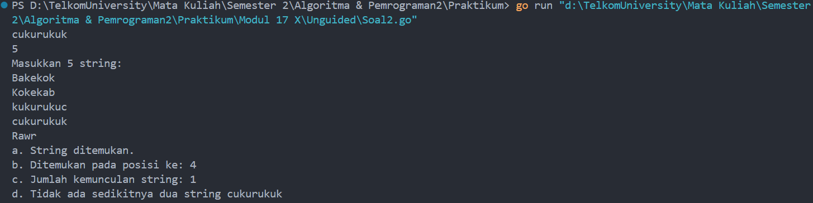

# <h1 align="center">Laporan Praktikum Modul 17 <br>  Skema Pemrosesan Sekuensial </h1>
<p align="center">ABYAN RAHMAN AL FARIZ - 103112430021</p>

## Dasar Teori
___

Pemrosesan sekuensial (_sequential processing_) adalah skema eksekusi program atau algoritma yang berjalan secara berurutan, langkah demi langkah, dari satu instruksi ke instruksi berikutnya. Setiap langkah diselesaikan terlebih dahulu sebelum melanjutkan ke langkah berikutnya.

## Guided
___
#### Soal 1

``` go
package main

import (
    "fmt"
)

  
func bubbleSort(arr []int) int {
    n := len(arr)
    swapCount := 0

    for i := 0; i < n-1; i++ {
        for j := 0; j < n-i-1; j++ {
            if arr[j] > arr[j+1] {
                arr[j], arr[j+1] = arr[j+1], arr[j]
                swapCount++
            }
        }
    }
    return swapCount
}

  
func main() {
    nilai := []int{75, 60, 90, 85, 70}
    fmt.Println("Sebelum diurutkan:", nilai)

    swap := bubbleSort(nilai)

    fmt.Println("Setelah diurutkan:", nilai)
    fmt.Printf("Jumlah pertukaran (swap) yang terjadi: %d\n", swap)
}
```

> Output
> 

### **Penjelasan Program**

Program ini bertujuan untuk mengurutkan sebuah array bilangan bulat menggunakan algoritma _Bubble Sort_, serta menghitung berapa kali pertukaran (swap) terjadi selama proses pengurutan. Program diawali dengan mendefinisikan sebuah fungsi bernama `bubbleSort` yang menerima parameter berupa slice integer dan mengembalikan jumlah pertukaran.

Di dalam fungsi tersebut, program melakukan dua lapis perulangan untuk membandingkan pasangan elemen yang berdekatan. Jika elemen di sebelah kiri lebih besar daripada elemen di sebelah kanan, maka posisi keduanya akan ditukar, dan variabel `swapCount` akan ditambah satu. Proses ini akan terus dilakukan sampai seluruh elemen berada dalam urutan yang benar (dari kecil ke besar).

Fungsi `main` dalam program ini mendefinisikan slice integer `nilai` berisi lima angka acak. Slice tersebut ditampilkan ke layar sebelum dan sesudah diproses dengan fungsi `bubbleSort`. Setelah pengurutan selesai, hasil akhir dan total jumlah pertukaran akan dicetak sebagai output.

### **Kesimpulan**

Program ini merupakan implementasi dasar dari algoritma _Bubble Sort_, salah satu metode pengurutan sederhana yang bekerja dengan cara membandingkan dan menukar elemen-elemen yang berdekatan. Meskipun algoritma ini tidak efisien untuk dataset besar, ia sangat cocok untuk memahami konsep dasar pengurutan karena logikanya yang mudah dipahami. Selain itu, dengan menghitung jumlah pertukaran, program juga memberikan wawasan tambahan tentang seberapa "acak" data awal yang diberikan.

## Unguided
___
#### Soal 1

> Diberikan sejumlah bilangan real yang diakhiri dengan marker 9999, cari rerata dari bilanganbilangan tersebut.

```go
package main

import "fmt"

  
func main() {
    var angka, ratarata float64
    var jumlah float64 = 0
    var banyak int = 0

    for {
        fmt.Scan(&angka)
        if angka == 9999 {
            break
        }
        jumlah += angka
        banyak++
    }
    
    if banyak > 0 {
        ratarata = jumlah / float64(banyak)
        fmt.Println(ratarata)
    } else {
        fmt.Println("Tidak ada data untuk dihitung.")
    }
}
```

> Output
> 
> 

### **Penjelasan Program:**

Program ini bertujuan untuk menghitung rata-rata dari sejumlah input angka bertipe _float64_ yang dimasukkan oleh pengguna. Proses input dilakukan secara terus-menerus hingga pengguna memasukkan angka khusus `9999` sebagai penanda akhir (sentinel value). Nilai `9999` sendiri tidak ikut dihitung dalam perhitungan rata-rata.

Program dimulai dengan mendeklarasikan beberapa variabel: `angka` untuk menyimpan input sementara dari pengguna, `jumlah` untuk menjumlahkan seluruh angka yang valid, `banyak` untuk menghitung berapa banyak angka yang dimasukkan, serta `ratarata` untuk menyimpan hasil akhir dari pembagian jumlah dan banyak data.

Penggunaan perulangan `for` tanpa kondisi (`for { ... }`) memungkinkan program terus menerima input tanpa batas hingga kondisi `angka == 9999` tercapai, di mana program akan keluar dari loop dengan `break`. Setelah proses input selesai, program akan mengecek apakah ada data yang berhasil dimasukkan (`banyak > 0`). Jika iya, maka rata-rata akan dihitung dan ditampilkan. Jika tidak ada data sama sekali (misalnya pengguna langsung memasukkan `9999`), maka program akan mencetak pesan bahwa tidak ada data yang bisa dihitung.

### **Kesimpulan:**

Program ini merupakan implementasi dari proses perhitungan rata-rata menggunakan pendekatan sentinel value untuk menghentikan input. Teknik ini berguna dalam situasi di mana jumlah data tidak diketahui sejak awal. Program juga menampilkan penggunaan kontrol alur `for` tanpa kondisi sebagai bentuk perulangan tak terbatas hingga kondisi tertentu dipenuhi.

#### Soal 2

> Diberikan string x dan n buah string. x adalah data pertama yang dibaca, n adalah data bilangan yang dibaca kedua, dan n data berikutnya adalah data string. Buat algoritma untuk menjawab pertanyaan berikut:

>  a. Apakah string x ada dalam kumpulan n data string tersebut?
>  b. Pada posisi ke berapa string x tersebut ditemukan? 
>  c. Ada berapakah string x dalam kumpulan n data string tersebut? 
>  d. Adakah sedikitnya dua string x dalam n data string tersebut?

```go
package main

import "fmt"

  
func inputData() (string, int) {
    var x string
    var n int

    fmt.Scan(&x)
    fmt.Scan(&n)

    return x, n
}


func bacaDataString(n int) []string {
    data := make([]string, n)

    fmt.Println("Masukkan", n, "string:")

    for i := 0; i < n; i++ {
        fmt.Scan(&data[i])
    }
    return data
}

  
func cariString(data []string, x string) (bool, int, int) {
    ditemukan := false
    jumlah := 0
    posisi := -1
  
    for i := 0; i < len(data); i++ {
        if data[i] == x {
            jumlah++
            if !ditemukan {
                ditemukan = true
                posisi = i + 1
            }
        }
    }
    return ditemukan, posisi, jumlah
}
  

func tampilkanHasil(x string, ditemukan bool, posisi int, jumlah int) {
    if ditemukan {
        fmt.Println("a. String ditemukan.")
        fmt.Println("b. Ditemukan pada posisi ke:", posisi)
    } else {
        fmt.Println("a. String tidak ditemukan.")
        fmt.Println("b. Tidak ditemukan, jadi tidak ada posisi.")
    }
    fmt.Println("c. Jumlah kemunculan string:", jumlah)
    if jumlah >= 2 {
        fmt.Println("d. Ada sedikitnya dua string", x)
    } else {
        fmt.Println("d. Tidak ada sedikitnya dua string", x)
    }
}
  

func main() {
    x, n := inputData()
    data := bacaDataString(n)

    ditemukan, posisi, jumlah := cariString(data, x)
    tampilkanHasil(x, ditemukan, posisi, jumlah)
}
```

> Output
> 

### **Penjelasan Program:**

Program ini dirancang untuk mencari keberadaan sebuah string tertentu (`x`) dalam sebuah kumpulan data string yang diinput oleh pengguna. Proses dimulai dari fungsi `inputData()` yang membaca dua input awal, yaitu string yang akan dicari dan banyaknya data string (`n`) yang akan dimasukkan selanjutnya.

Fungsi `bacaDataString(n int)` bertugas membaca `n` string dari pengguna, menyimpannya ke dalam sebuah slice bertipe `[]string`. Data ini kemudian akan diproses oleh fungsi `cariString`, yang memiliki tanggung jawab utama untuk melakukan pencarian string `x` dalam array tersebut. Fungsi ini akan mengembalikan informasi apakah string ditemukan (`bool`), posisi pertama kemunculannya (`int`), dan berapa kali string tersebut muncul dalam data (`int`).

Apabila string ditemukan, program mencetak posisi pertama ditemukannya string tersebut. Selanjutnya, terlepas dari apakah string ditemukan atau tidak, program akan mencetak jumlah kemunculan string dan memberi keterangan tambahan jika string muncul minimal dua kali. Seluruh output akhir dikelola oleh fungsi `tampilkanHasil`.

### **Kesimpulan:**

Program ini menunjukkan bagaimana implementasi dasar pencarian dalam kumpulan data string dapat dilakukan secara sistematis. Penggunaan slice sebagai struktur data memungkinkan pengelolaan array dinamis, sementara pemisahan fungsi memudahkan proses debugging dan pengembangan. Logika pencarian linear yang digunakan cukup efisien untuk jumlah data yang tidak terlalu besar.


#### Soal 3

> Empat daerah A, B, C, dan D yang berdekatan ingin mengukur curah hujan. Keempat daerah tersebut digambarkan pada bidang berikut:
> 

|  D  |  C  |
| :-: | :-: |
|  A  |  B  |
(0,0) kiri bawah     (1,1) kanan atas

>Misal curah hujan dihitung berdasarkan banyaknya tetesan air hujan. Setiap tetesan berukuran 0.0001 ml curah hujan. Tetesan air hujan turun secara acak dari titik (0,0) sampai (1,1). Jika diterima input yang menyatakan banyaknya tetesan air hujan. Tentukan curah hujan untuk keempat daerah tersebut. Buatlah program yang menerima input berupa banyaknya tetesan air hujan. Kemudian buat koordinat/titik (x, y) secara acak dengan menggunakan fungsi rand.Float64(). Hitung dan tampilkan banyaknya tetesan yang jatuh pada daerah A, B, C dan D. Konversikan satu tetesan berukuran 0.0001 milimeter.

> Catatan: Lihat lampiran untuk informasi menggunakan paket math/rand untuk menggunakan rand.Float64() yang menghasilkan bilangan riil acak [0..1].
 
```go
package main

import (
    "fmt"
    "math/rand"
    "time"
)

  
func inputJumlahTetes() int {
    var jumlah int

    fmt.Print("Masukkan jumlah tetesan air hujan: ")
    fmt.Scan(&jumlah)
    
    return jumlah
}

  
func hitungTetesan(jumlah int) (int, int, int, int) {
    rand.Seed(time.Now().UnixNano())
    
    a, b, c, d := 0, 0, 0, 0

    for i := 0; i < jumlah; i++ {
        x := rand.Float64()
        y := rand.Float64()

        if x < 0.5 && y < 0.5 {
            a++
        } else if x >= 0.5 && y < 0.5 {
            b++
        } else if x >= 0.5 && y >= 0.5 {
            c++
        } else if x < 0.5 && y >= 0.5 {
            d++
        }
    }
    return a, b, c, d
}

  
func tampilkanCurahHujan(a, b, c, d int) {
    const volumePerTetes = 0.0001 // ml atau mm per tetes

    fmt.Printf("Curah hujan daerah A: %.4f milimeter\n", float64(a)*volumePerTetes)
    fmt.Printf("Curah hujan daerah B: %.4f milimeter\n", float64(b)*volumePerTetes)
    fmt.Printf("Curah hujan daerah C: %.4f milimeter\n", float64(c)*volumePerTetes)
    fmt.Printf("Curah hujan daerah D: %.4f milimeter\n", float64(d)*volumePerTetes)
}

  
func main() {
    jumlah := inputJumlahTetes()
    a, b, c, d := hitungTetesan(jumlah)

    tampilkanCurahHujan(a, b, c, d)
}
```

> Output
> 

### **Penjelasan Program:**

Program ini digunakan untuk mensimulasikan distribusi tetesan air hujan secara acak ke dalam empat wilayah yang berbeda, yaitu A, B, C, dan D. Proses dimulai dengan meminta input jumlah tetesan air hujan melalui fungsi `inputJumlahTetes()`. Nilai ini akan menentukan berapa banyak tetesan yang akan disimulasikan jatuh ke suatu area dalam koordinat dua dimensi.

Pada bagian inti, fungsi `hitungTetesan` akan mensimulasikan koordinat acak `(x, y)` dari tiap tetesan menggunakan `rand.Float64()` yang menghasilkan nilai antara 0 hingga 1. Berdasarkan posisi koordinat tersebut, program membagi bidang menjadi empat kuadran:

- Wilayah A: x < 0.5 dan y < 0.5
- Wilayah B: x ≥ 0.5 dan y < 0.5
- Wilayah C: x ≥ 0.5 dan y ≥ 0.5
- Wilayah D: x < 0.5 dan y ≥ 0.5    

Setiap tetesan akan dihitung berdasarkan posisi jatuhnya, dan jumlah masing-masing wilayah disimpan dalam variabel `a`, `b`, `c`, dan `d`.

Hasil akhir dari simulasi ini ditampilkan melalui fungsi `tampilkanCurahHujan`, yang menghitung curah hujan berdasarkan jumlah tetesan dikalikan dengan volume tetesan tetap (`0.0001` milimeter per tetes). Output berupa curah hujan (dalam satuan milimeter) untuk masing-masing wilayah akan ditampilkan ke layar.

### **Kesimpulan:**

Program ini merupakan simulasi sederhana untuk mendistribusikan tetesan air hujan menggunakan pendekatan probabilistik berbasis koordinat acak. Dengan memetakan bidang ke dalam empat wilayah dan menghitung banyaknya tetesan yang jatuh ke masing-masing area, program dapat digunakan untuk memperkirakan curah hujan pada tiap wilayah. Simulasi ini juga menunjukkan pemanfaatan fungsi acak (`random`) dalam pemodelan kejadian alam secara digital.

#### Soal 4

> Berdasarkan formula Leibniz, nilai π dapat dinyatakan sebagai deret harmonik ganti sebagai berikut:

$$
  1− \frac13+ \frac15− \frac17+ \frac19−⋯= \fracπ4
$$

> Suku ke-i dinyatakan sebagai 𝑆 dan jumlah deret adalah 𝑆. Apabila diketahui suku pertama S1 =1, suku kedua 𝑆 = -1/3 Temukan rumus untuk suku ke-𝒊 atau 𝑆. Berdasarkan rumus tersebut, buatlah program yang menghitung 𝑆 untuk 1000000 suku pertama. Perhatikan contoh sesi interaksi program di bawah ini (teks bergaris bawah adalah input/read):

```
N suku pertama: 1000000
Hasil PI: 3.1415951
```
> Setelah jalan, modifikasi program tersebut agar menyimpan nilai dua suku yang bersebelahan, Si dan 𝑆i+1 . Buatlah agar program tersebut sekarang berhenti apabila selisih dari kedua suku tersebut tidak lebih dari 0.00001. Perhatikan contoh sesi interaksi program di bawah ini (teks bergaris bawah adalah input/read):
```
N suku pertama: 1000000 
Hasil PI: 3.1415876535 
Hasil PI: 3.1415976535 
Pada i ke: 200002
```
 
``` go
package main  

import (
    "fmt"
    "math"
)

  
func bulatkan10(x float64) float64 {
    return math.Trunc(x*1e10) / 1e10
}

  
func hitungPI(batas int) (float64, float64, int) {
    var total float64
    var sebelumnya, sekarang float64
    var tanda float64 = 1.0
  
    for i := 0; i < batas; i++ {
        suku := tanda / float64(2*i+1)
        total += suku
        sekarang = total * 4

        if i > 0 {
            selisih := math.Abs(sekarang - sebelumnya)
            if selisih < 0.00001 {
                return bulatkan10(sebelumnya), bulatkan10(sekarang), i + 1
            }
        }

        sebelumnya = sekarang
        tanda *= -1
    }
    return bulatkan10(sebelumnya), bulatkan10(sekarang), batas
}

  
func main() {
    var jumlahSuku int

    fmt.Print("N suku pertama: ")
    fmt.Scan(&jumlahSuku)

    pi1, pi2, iterasi := hitungPI(jumlahSuku)

    fmt.Printf("Hasil PI: %.10f\n", pi1)
    fmt.Printf("Hasil PI: %.10f\n", pi2)
    fmt.Printf("Pada i ke: %d\n", iterasi)
}
```

> Output
> 


### **Penjelasan Program:**

Program ini ditujukan untuk menghitung nilai pendekatan konstanta matematika π (pi) menggunakan deret Leibniz. Perhitungan dilakukan secara iteratif hingga batas jumlah suku tertentu yang ditentukan oleh pengguna, atau hingga selisih antar hasil pendekatan dua iterasi terakhir lebih kecil dari batas toleransi yang telah ditentukan.

Di awal, fungsi `main` meminta input jumlah suku (`N suku pertama`) dari pengguna. Input ini kemudian diteruskan ke fungsi `hitungPI`, yang berfungsi untuk menghitung nilai π. Proses perhitungan menggunakan rumus:

$$
\pi \approx 4 \times \left(1 - \frac{1}{3} + \frac{1}{5} - \frac{1}{7} + \dots\right)
$$

Perhitungan dilakukan dengan menambahkan atau mengurangi nilai dari suku saat ini, tergantung dari nilai `tanda`, yang bergantian antara positif dan negatif. Hasil sementara dari jumlah suku akan dikalikan dengan 4 untuk mendapatkan pendekatan π saat itu.

Program juga menghitung selisih absolut antara hasil pendekatan saat ini dan sebelumnya. Jika selisih tersebut kurang dari 0.00001, maka proses dihentikan dan hasil dikembalikan. Nilai π dibulatkan hingga 10 angka di belakang koma menggunakan fungsi `bulatkan10` untuk menjaga konsistensi tampilan.

Output dari program menampilkan dua hasil pendekatan nilai π, yakni sebelum dan sesudah mencapai batas toleransi, serta iterasi keberapa hal tersebut terjadi.

### **Kesimpulan:**

Program ini merupakan implementasi dari metode pendekatan nilai π menggunakan deret tak hingga Leibniz. Dengan logika perulangan dan pendekatan numerik, program mampu menghentikan proses saat hasil yang diperoleh sudah cukup mendekati nilai sebenarnya. Ini membuktikan bahwa konsep deret matematis dapat diaplikasikan secara praktis dalam pemrograman untuk menghitung konstanta matematika dengan akurasi tertentu.


#### Soal 5

> Monti bekerja pada sebuah kedai pizza, saking ramainya kedai tersebut membuat Monti tidak ada waktu untuk bersantai. Suatu ketika saat sedang menaburkan topping pada pizza yang diletakkan pada wadah berbentuk persegi, terpikirkan oleh Monti cara menghitung berapa banyak topping yang dia butuhkan, dan cara menghitung nilai 𝝅. Ilustrasi seperti gambar yang diberikan di bawah, topping adalah lingkaran-lingkaran kecil. Ada yang tepat berada di atas pizza, dan ada yang jatuh di dalam kotak tetapi berada di luar pizza. Apabila luas pizza yang memiliki radius r adalah 𝐿𝑢𝑎𝑠𝑃𝑖𝑧𝑧𝑎 = 𝜋𝑟 dan luas wadah pizza yang memiliki panjang sisi 𝑑 = 2𝑟 adalah 𝐿𝑢𝑎𝑠𝑊𝑎𝑑𝑎ℎ = 𝑑 = 4𝑟 , maka diperoleh perbandingan luas kedua bidang tersebut
> 

$$ 
\frac {LuasPizza}{LuasWadah} = \frac \pi  {4r^2} = \frac \pi {4}
$$
 
> Persamaan lingkaran adalah (𝑥 − 𝑥) + (𝑦 − 𝑦) = 𝑟 dengan titik pusat lingkaran adalah (𝑥 ,𝑦). Suatu titik sembarang (𝑥,𝑦) dikatakan berada di dalam lingkaran apabila memenuhi ketidaksamaan:

$$
(x-xc)^2 + (y-yc)^2 ≤ r^2
$$
  
>Pada ilustrasi topping berbentuk bulat kecil merah dan biru pada gambar adalah titik-titik (𝑥, 𝑦) acak pada sebuah wadah yang berisi pizza. Dengan jumlah yang sangat banyak dan ditaburkan merata (secara acak), maka kita bisa mengetahui berapa banyak titik/topping yang berada tepat di dalam pizza menggunakan ketidaksamaan di atas. Buatlah program yang menerima input berupa banyaknya topping yang akan ditaburkan, kemudian buat titik acak (𝑥, 𝑦) dari bilangan acak riil pada kisaran nilai 0 hingga 1 sebanyak topping yang diberikan. Hitung dan tampilkan berapa banyak topping yang jatuh tepat di atas pizza. Titik pusat pizza adalah (0.5, 0.5) dan jari-jari pizza adalah 0.5 satuan wadah. Perhatikan contoh sesi interaksi program di bawah ini (teks bergaris bawah adalah input/read):


| Banyaknya Topping: 1234567<br><br>Topping pada Pizza: 969000 | Banyaknya Topping: 10000000<br><br>Topping pada Pizza: 7856565<br><br> |
| ------------------------------------------------------------ | ---------------------------------------------------------------------- |

> Apabila topping yang ditaburkan oleh Monti secara merata berjumlah yang sangat banyak, maka topping akan menutupi keseluruhan wadah pizza. Luas Pizza sebanding dengan topping yang berada pada pizza, sedangkan Luas Wadah sebanding dengan banyaknya topping yang ditaburkan. Dengan menggunakan rumus perbandingan luas yang diberikan di atas, maka nilai konstanta 𝜋 dapat dihitung. Modifikasi program di atas sehingga dapat menghitung dan menampilkan nilai konstanta π. Perhatikan contoh sesi interaksi program di bawah ini (teks bergaris bawah adalah input/read):

| Banyaknya Topping: 1234567 <br><br>Topping pada Pizza: 969206<br><br>PI: 3.1402297324<br> | Banyaknya Topping: 10                <br><br>Topping pada Pizza: 5<br><br>PI: 2.0000000000 |
| ----------------------------------------------------------------------------------------- | ------------------------------------------------------------------------------------------ |
| <br>Banyaknya Topping: 256<br><br>Topping pada Pizza: 198<br><br>PI: 3.0937500000         | <br>Banyaknya Topping: 5000<br><br>Topping pada Pizza: 3973<br><br>PI: 3.1784000000        |

``` go
package main

import (
    "fmt"
    "math/rand"
    "time"
)

  
func getToppingCount() int {
    var total int

    fmt.Print("Banyak Topping: ")
    fmt.Scanln(&total)
    
    return total
}

  
func simulateToppings(total int) int {
    rand.Seed(time.Now().UnixNano())
    countInside := 0

    for i := 0; i < total; i++ {
        x := rand.Float64()
        y := rand.Float64()

        if (x-0.5)*(x-0.5)+(y-0.5)*(y-0.5) <= 0.25 {
            countInside++
        }
    }
    return countInside
}

  
func estimatePi(total, inside int) float64 {
    prop := float64(inside) / float64(total)

    return prop * 4
}
  

func showResult(total, inside int, pi float64) {
    fmt.Printf("Topping pada Pizza: %d\n", inside)
    fmt.Printf("PI : %.10f\n", pi)
}

  
func main() {
    topping := getToppingCount()
    jatuhDiPizza := simulateToppings(topping)
    pi := estimatePi(topping, jatuhDiPizza)

    showResult(topping, jatuhDiPizza, pi)
}
```

> Output
> 


### **Penjelasan Program:**

Program ini melakukan estimasi nilai π (pi) menggunakan metode simulasi Monte Carlo, dengan analogi “menjatuhkan topping secara acak ke atas permukaan pizza”. Pada dasarnya, program memodelkan sebuah lingkaran berdiameter 1 satuan yang berada di dalam kotak persegi 1×1 satuan. Titik pusat lingkaran berada di titik (0.5, 0.5), dan titik-titik acak (x, y) yang mewakili posisi topping dijatuhkan secara acak ke dalam kotak tersebut.


Proses simulasi dimulai dengan meminta pengguna memasukkan jumlah topping (jumlah iterasi simulasi). Fungsi `simulateToppings` kemudian menjatuhkan titik acak sebanyak jumlah topping yang diberikan. Jika titik acak tersebut jatuh di dalam lingkaran (menggunakan persamaan 
$$
(x−0.5)^2+(y−0.5)^2≤0.25),
$$ maka variabel penghitung `countInside` akan bertambah.


Setelah semua titik dijatuhkan, program menghitung proporsi titik yang berada di dalam lingkaran terhadap total titik yang dijatuhkan. Nilai ini dikalikan dengan 4 untuk mendapatkan estimasi nilai π, sesuai dengan rumus Monte Carlo:

$$
\pi \approx 4 \times \frac{\text{jumlah titik dalam lingkaran}}{\text{jumlah total titik}}​
$$
Hasil akhir ditampilkan melalui fungsi `showResult`, yang mencetak jumlah topping yang jatuh di dalam lingkaran dan nilai estimasi π dengan presisi hingga 10 angka di belakang koma.

### **Kesimpulan:**

Program ini menggunakan pendekatan probabilistik untuk mengestimasi nilai π melalui simulasi Monte Carlo. Dengan menjatuhkan titik-titik acak dan menghitung proporsi titik yang berada di dalam lingkaran, program mampu memberikan pendekatan nilai π tanpa menggunakan perhitungan matematis eksplisit.

[^1]:


