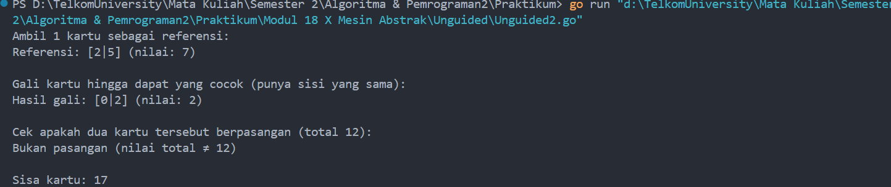

# <h1 align="center">Laporan Praktikum Modul 18 <br>  Mesin Abstrak </h1>
<p align="center">ABYAN RAHMAN AL FARIZ - 103112430021</p>

## Dasar Teori
___

Mesin abstrak adalah model konseptual yang digunakan untuk memproses data atau simbol secara sistematis berdasarkan seperangkat aturan tertentu. Dalam konteks pemrograman, mesin abstrak sering diimplementasikan sebagai rangkaian prosedur dan fungsi yang bekerja layaknya "mesin baca", seperti pada mesin karakter yang membaca urutan karakter satu per satu hingga mencapai kondisi akhir. Tujuan dari mesin abstrak adalah menyederhanakan pemrosesan data yang kompleks menjadi langkah-langkah operasional yang terstruktur dan dapat diulang, sehingga mempermudah analisis, pencarian pola, atau otomatisasi pengolahan data dalam berbagai kasus seperti pengenalan pola, kompilasi bahasa, dan pemrosesan string.

## Unguided
___
#### Soal 1

>Implementasi operasi dasar mesin domino sebagai sebuah subprogram: a) Buat tipe data kartu domino (Domino) yang menyimpan informasi 1.) gambar (suit) kedua sisi kartu 2.) nilai kartu 3.) Boolean data yang menyatakan kartu ini balak atau bukan 4.) Buat tipe data satu set kartu domino (Dominoes) 5.) Array menyimpan 28 kartu Domino 6.) Jumlah kartu tersisa dalam array tersebut b) prosedur kocokKartu(Dominoes) c) fungsi ambilKartu(Dominoes) à Domino d) fungsi gambarKartu(Domino,suit int) à int e) fungsi nilaiKartu(Domino) à int

```go
package main

import (
    "fmt"
    "math/rand"
    "time"
)

  
type Domino struct {
    suit  [2]int  
    nilai int    
    balak bool    
}

  
type Dominoes struct {
    kartu  [28]Domino
    jumlah int      
}

  
func kocokKartu(d *Dominoes) {
    idx := 0
    
    for i := 0; i <= 6; i++ {
        for j := i; j <= 6; j++ {
            d.kartu[idx] = Domino{
                suit:  [2]int{i, j},
                nilai: i + j,
                balak: i == j,
            }
            idx++
        }
    }
    d.jumlah = 28


    rand.Seed(time.Now().UnixNano())
    
    for i := range d.kartu {
        r := rand.Intn(28)
        d.kartu[i], d.kartu[r] = d.kartu[r], d.kartu[i]
    }
}

  
func ambilKartu(d *Dominoes) Domino {
    if d.jumlah == 0 {
        return Domino{}
    }
    d.jumlah--
    return d.kartu[d.jumlah]
}

  
func gambarKartu(d Domino, sisi int) int {
    if sisi == 0 || sisi == 1 {
        return d.suit[sisi]
    }
    return -1
}

  
func nilaiKartu(d Domino) int {
    return d.nilai
}

  
func main() {
    var set Dominoes
    kocokKartu(&set)
  
    fmt.Println("Ambil 5 kartu pertama dari set:")
    
    for i := 0; i < 5; i++ {

        kartu := ambilKartu(&set)
        fmt.Printf("Kartu %d: [%d|%d] | Nilai: %d | Balak: %v\n",
            i+1,
            gambarKartu(kartu, 0),
            gambarKartu(kartu, 1),
            nilaiKartu(kartu),
            kartu.balak,
        )
    }
    fmt.Printf("Sisa kartu di set: %d\n", set.jumlah)
}
```

> Output
> 
> 

### **Penjelasan Program:**

Program ini bertujuan untuk membuat dan mengacak set kartu domino standar (28 kartu) dengan menggunakan **struct** untuk merepresentasikan kartu domino dan sekumpulan kartu domino. Struct `Domino` menyimpan data nilai sisi kiri dan kanan kartu, total nilai kartu, dan status apakah kartu itu balak (dua sisi sama). Sedangkan struct `Dominoes` menyimpan kumpulan 28 kartu dan jumlah kartu yang tersisa.

Program mengimplementasikan fungsi untuk:

- **Membuat dan mengacak kartu domino** (`kocokKartu`), dengan mengisi kartu dari kombinasi angka 0 sampai 6, lalu mengacak posisi kartu secara acak menggunakan _shuffle_.
    
- **Mengambil kartu dari set** (`ambilKartu`), dengan mengurangi jumlah kartu tersisa dan mengembalikan kartu paling atas dari tumpukan.
    
- **Mengakses nilai sisi kartu** (`gambarKartu`) dan **nilai total kartu** (`nilaiKartu`).
    

Pada fungsi `main`, program menampilkan 5 kartu pertama yang diambil dari set yang sudah diacak, menampilkan sisi kiri dan kanan kartu, nilai total kartu, serta status balak. Program juga menampilkan sisa kartu yang masih tersedia dalam set setelah pengambilan.


### **Kesimpulan:**

Program ini memanfaatkan **struct** untuk merepresentasikan data kompleks, yaitu kartu domino yang memiliki dua sisi angka, nilai total, dan status balak. Dengan menggunakan struct `Dominoes`, program dapat mengelola kumpulan kartu secara terstruktur dan mudah untuk dimanipulasi, seperti diacak dan diambil satu per satu.

Penggunaan fungsi-fungsi modular seperti `kocokKartu`, `ambilKartu`, dan fungsi akses data membuat program menjadi lebih terorganisir dan mudah dipahami. Program juga menggunakan **random shuffle** untuk mengacak posisi kartu, sehingga simulasi pengambilan kartu domino menjadi lebih realistis.

Dengan kondisi sederhana dan pengelolaan data yang rapi, program ini efektif untuk merepresentasikan dan memanipulasi set kartu domino, serta menampilkan informasi penting setiap kartu dengan jelas dan sistematis.

#### Soal 2


>Realisasi aksi berikut menggunakan operasi-operasi dasar mesin domino: a) prosedur galiKartu(Dominoes,Domino) yang mengambil kartu dari tumpukan sampai diperoleh kartu dengan gambar (suit) yang sama dengan kartu yang diberikan. b) fungsi sepasangKartu(Domino,Domino) à boolean; yang memberikan nilai true jika total nilai kartu adalah 12 dan false jika tidak.

```go
package main

import (
    "fmt"
    "math/rand"
    "time"
)

  
type Domino struct {
    suit  [2]int
    nilai int
    balak bool
}

  
type Dominoes struct {
    kartu  [28]Domino
    jumlah int
}

  
func kocokKartu(d *Dominoes) {
    idx := 0

    for i := 0; i <= 6; i++ {
        for j := i; j <= 6; j++ {
            d.kartu[idx] = Domino{
                suit:  [2]int{i, j},
                nilai: i + j,
                balak: i == j,
            }
            idx++
        }
    }
    d.jumlah = 28
    
    rand.Seed(time.Now().UnixNano())

    for i := range d.kartu {
        r := rand.Intn(28)
        d.kartu[i], d.kartu[r] = d.kartu[r], d.kartu[i]
    }
}

  
func ambilKartu(d *Dominoes) Domino {
    if d.jumlah == 0 {
        return Domino{}
    }
    d.jumlah--
    return d.kartu[d.jumlah]
}

  
func gambarKartu(d Domino, sisi int) int {
    if sisi == 0 || sisi == 1 {
        return d.suit[sisi]
    }
    return -1
}

  
func nilaiKartu(d Domino) int {
    return d.nilai
}

  
func galiKartu(d *Dominoes, referensi Domino) Domino {
    for d.jumlah > 0 {
        kartu := ambilKartu(d)
        if kartu.suit[0] == referensi.suit[0] || kartu.suit[0] == referensi.suit[1] ||
            kartu.suit[1] == referensi.suit[0] || kartu.suit[1] == referensi.suit[1] {
            return kartu
        }
    }
    return Domino{}
}

  
func sepasangKartu(a Domino, b Domino) bool {
    return a.nilai+b.nilai == 12
}

  
func main() {
    var set Dominoes

    kocokKartu(&set)

    fmt.Println("Ambil 1 kartu sebagai referensi:")
    referensi := ambilKartu(&set)
    fmt.Printf("Referensi: [%d|%d] (nilai: %d)\n", referensi.suit[0], referensi.suit[1], referensi.nilai)

    fmt.Println("\nGali kartu hingga dapat yang cocok (punya sisi yang sama):")
    kartuGali := galiKartu(&set, referensi)

    fmt.Printf("Hasil gali: [%d|%d] (nilai: %d)\n", kartuGali.suit[0], kartuGali.suit[1], kartuGali.nilai)

    fmt.Println("\nCek apakah dua kartu tersebut berpasangan (total 12):")
    if sepasangKartu(referensi, kartuGali) {
        fmt.Println("YA! Sepasang (nilai total = 12)")
    } else {
        fmt.Println("Bukan pasangan (nilai total ≠ 12)")
    }

    fmt.Printf("\nSisa kartu: %d\n", set.jumlah)
}
```

> Output
> 

### **Penjelasan Program:**

Program ini mengimplementasikan operasi dasar pada permainan domino dengan menggunakan **struct** untuk merepresentasikan kartu domino (`Domino`) dan kumpulan kartu domino (`Dominoes`). Program berfokus pada dua aksi utama:

1. **Prosedur `galiKartu`** yang mengambil kartu secara berturut-turut dari tumpukan kartu sampai ditemukan kartu yang memiliki sisi (gambar/suit) yang sama dengan salah satu sisi kartu referensi yang diberikan. Prosedur ini secara otomatis mengambil kartu dari set dan mengecek kesamaan sisi, lalu mengembalikan kartu pertama yang cocok. Jika tidak ditemukan, prosedur mengembalikan kartu kosong (`Domino{}`).
    
2. **Fungsi `sepasangKartu`** yang menerima dua kartu domino dan mengembalikan nilai boolean `true` jika jumlah total nilai kedua kartu sama dengan 12, dan `false` jika tidak.
    

Program diawali dengan pembuatan dan pengocokan kartu domino menggunakan fungsi `kocokKartu`. Kemudian mengambil satu kartu sebagai referensi. Selanjutnya, prosedur `galiKartu` dipanggil untuk mengambil kartu yang memiliki sisi sama dengan kartu referensi tersebut. Setelah itu, fungsi `sepasangKartu` digunakan untuk mengecek apakah kedua kartu tersebut membentuk pasangan dengan total nilai 12.

Output program menampilkan kartu referensi, hasil gali kartu yang cocok, hasil pemeriksaan pasangan kartu, serta jumlah kartu yang tersisa di tumpukan setelah operasi.

### **Kesimpulan:**

Program ini memanfaatkan **struct** untuk menyimpan data kartu domino dengan atribut sisi, nilai, dan status balak, serta kumpulan kartu dalam bentuk array. Dengan prosedur `galiKartu`, program dapat melakukan pencarian kartu yang sesuai kriteria dengan cara mengambil kartu satu per satu dari tumpukan dan membandingkan sisi kartu tersebut dengan kartu referensi secara efisien.

Fungsi `sepasangKartu` memberikan mekanisme sederhana untuk memeriksa apakah dua kartu memenuhi syarat pasangan berdasarkan total nilai. Dengan pendekatan modular menggunakan prosedur dan fungsi, program menjadi lebih terstruktur dan mudah dikembangkan.
#### Soal 3

> Implementasi salah satu permainan domino. Lihat lampiran untuk deskripsi permainan Gapleh.

```go
package main

import (
    "fmt"
    "math/rand"
    "time"
)

  
type Domino struct {
    kiri  int
    kanan int
}

  
func buatSetKartuDomino() []Domino {
    var set []Domino
    for i := 0; i <= 6; i++ {
        for j := i; j <= 6; j++ {
            set = append(set, Domino{i, j})
        }
    }
    return set
}


func kocokKartu(kartu []Domino) {
    rand.Seed(time.Now().UnixNano())
    rand.Shuffle(len(kartu), func(i, j int) {
        kartu[i], kartu[j] = kartu[j], kartu[i]
    })
}

  
func cocok(kartu Domino, ujung int) bool {
    return kartu.kiri == ujung || kartu.kanan == ujung
}

  
func balikKartu(kartu Domino) Domino {
    return Domino{kartu.kanan, kartu.kiri}
}

  
func tampilkanKartu(kartu Domino) string {
    return fmt.Sprintf("[%d|%d]", kartu.kiri, kartu.kanan)
}

  
func printTangan(pemain []Domino) {
    for i, d := range pemain {
        fmt.Printf("%2d: %s\n", i+1, tampilkanKartu(d))
    }
}


func printRantai(rantai []Domino) {
    for _, d := range rantai {
        fmt.Print(tampilkanKartu(d), " ")
    }
    fmt.Println()
}

  
func main() {
    set := buatSetKartuDomino()
    ronde := 0
    skorTotal := 0

    for {
        ronde++
        fmt.Printf("\n=== Ronde %d ===\n", ronde)
        kocokKartu(set)

        tumpukan := append([]Domino(nil), set...)
        pemain := tumpukan[:7]
        tumpukan = tumpukan[7:]
        rantai := []Domino{tumpukan[0]}
        tumpukan = tumpukan[1:]
        skor := 0

        for {
            fmt.Println("\nRantai di meja:")
            printRantai(rantai)
  
            fmt.Println("\nKartu Anda:")
            printTangan(pemain)
  
            fmt.Println("101010: Akhiri Ronde | 909090: Akhiri Permainan")
            fmt.Print("Pilihan Anda (-7..-1 = kiri, 1..7 = kanan): ")

            var pilih int
            fmt.Scan(&pilih)

            if pilih == 101010 {
                fmt.Println("Ronde dihentikan.")
                break
            } else if pilih == 909090 {
                fmt.Println("Permainan selesai.")
                fmt.Printf("Total Ronde: %d | Skor Total: %d\n", ronde-1, skorTotal)
                return
            }

            if pilih == 0 || pilih < -len(pemain) || pilih > len(pemain) {
                fmt.Println("Input tidak valid.")
                continue
            }

            idx := pilih
            if idx < 0 {
                idx = -idx
            }

            if idx > len(pemain) {
                fmt.Println("Kartu tidak tersedia.")
                continue
            }
            
            kartu := pemain[idx-1]
            bisaMain := false

            if pilih < 0 {
                ujung := rantai[0].kiri
                if cocok(kartu, ujung) {
                    if kartu.kanan == ujung {
                        rantai = append([]Domino{kartu}, rantai...)
                    } else {
                        rantai = append([]Domino{balikKartu(kartu)}, rantai...)
                    }
                    bisaMain = true
                }
            } else {
                ujung := rantai[len(rantai)-1].kanan
                if cocok(kartu, ujung) {
                    if kartu.kiri == ujung {
                        rantai = append(rantai, kartu)
                    } else {
                        rantai = append(rantai, balikKartu(kartu))
                    }
                    bisaMain = true
                }
            }
            if bisaMain {
                pemain = append(pemain[:idx-1], pemain[idx:]...)
                skor++
            } else {
                if len(tumpukan) > 0 {
                    fmt.Println("Kartu tidak cocok. Mengambil kartu dari tumpukan...")
                    pemain = append(pemain, tumpukan[0])
                    tumpukan = tumpukan[1:]
                } else {
                    fmt.Println("Kartu tidak cocok dan tumpukan habis.")
                }
            }

            if len(pemain) == 0 {
                fmt.Println("Semua kartu habis. Ronde selesai!")
                break
            }

            bisaLanjut := false
            ujungKiri := rantai[0].kiri
            ujungKanan := rantai[len(rantai)-1].kanan
            
            for _, k := range pemain {
                if cocok(k, ujungKiri) || cocok(k, ujungKanan) {
                    bisaLanjut = true
                    break
                }
            }

            if !bisaLanjut && len(tumpukan) == 0 {
                fmt.Println("Tidak ada kartu yang bisa dimainkan dan tumpukan habis. Ronde selesai!")
                break
            }
        }
        fmt.Printf("Skor Ronde %d: %d\n", ronde, skor)
        skorTotal += skor
    }
}
```

> Output
> 

### **Penjelasan Program:**

Program ini mengimplementasikan permainan **Domino Gapleh** secara sederhana menggunakan tipe data `Domino` yang merepresentasikan satu kartu domino dengan dua sisi bernilai angka. Program mengelola set kartu domino standar (28 kartu) dan membagikan 7 kartu ke pemain.

Proses permainan berlangsung dalam beberapa ronde, dengan langkah-langkah utama sebagai berikut:

- Membuat set kartu domino dari kombinasi angka 0 sampai 6, lalu mengocoknya secara acak menggunakan `rand.Shuffle`.
    
- Membagikan 7 kartu ke pemain, dan memulai rantai kartu di meja dengan mengambil satu kartu dari tumpukan.
    
- Pemain dapat memilih kartu yang ingin dimainkan dengan input nomor indeks kartu di tangan. Pemain boleh meletakkan kartu di **ujung kiri** rantai (input negatif) atau **ujung kanan** rantai (input positif).
    
- Kartu hanya bisa dimainkan jika salah satu sisinya cocok dengan ujung rantai di meja. Jika sisi kartu tidak cocok, pemain harus mengambil kartu dari tumpukan jika masih tersedia.
    
- Permainan terus berjalan sampai salah satu kondisi selesai: pemain habis kartu, tidak ada kartu yang bisa dimainkan dan tumpukan habis, atau pemain memilih mengakhiri ronde/permainan.
    
- Skor dihitung berdasarkan jumlah kartu yang berhasil dimainkan pada tiap ronde, dan dijumlahkan sebagai skor total sepanjang permainan.
    

Program juga menampilkan rantai kartu yang ada di meja dan kartu yang dimiliki pemain secara interaktif pada setiap giliran.


### **Kesimpulan:**

Program ini menggunakan **struct Domino** untuk merepresentasikan kartu dengan dua sisi nilai, dan menggunakan slice untuk menyimpan set kartu, tangan pemain, rantai kartu di meja, serta tumpukan kartu yang tersisa.

Dengan pemanfaatan fungsi seperti `kocokKartu`, `cocok`, dan `balikKartu`, program berhasil mengelola logika dasar permainan Gapleh, termasuk pengecekan kecocokan kartu dan manipulasi rantai kartu di meja.

Interaksi dengan pemain dilakukan secara sederhana melalui input angka yang memungkinkan menempatkan kartu di ujung kiri atau kanan rantai, sehingga mengakomodasi dinamika permainan domino yang sebenarnya.

#### Soal 4

>Implementasi mesin abstrak karakter yang bekerja terhadap untaian karakter (yang diakhiri dengan penanda titik (".") dan mempunyai sejumlah operasi dasar. a) Operasi dasar mesin karakter: 1.) Prosedur start(); yang menyiapkan mesin karakter di awal rangkaian karakter. 2.) Prosedur maju(); yang memajukan pembaca ke posisi karakter berikutnya. 3.) Fungsi eop(); yang mengembalikan nilai true apabila sudah mencapai akhir rangkaian, sampai ke penanda titik ("."). 4.) Fungsi cc(); yang mengembalikan karakter yang sedang terbaca, atau berada pada posisi pembacaan mesin. b) Dengan operasi dasar di atas buat algoritma untuk: 1.) Membaca seluruh karakter yang diberikan ke mesin karakter tersebut. 2.) Menghitung berapa banyak karakter yang terbaca. 3.) Menghitung ada berapa huruf "A" yang terbaca. 4.) Menghitung frekuensi kemunculan huruf "A" terhadap seluruh karakter terbaca. 5.) Menghitung ada berapa kata "LE" (pasangan berturutan huruf "L" dan "E") yang terbaca.

```go
package main

import (
    "fmt"
    "strings"
)

var tape string    
var idx int        


func start(input string) {
    tape = input
    idx = 0
}

  
func maju() {
    if !eop() {
        idx++
    }
}

  
func eop() bool {
    return idx >= len(tape) || tape[idx] == '.'
}


func cc() byte {
    if !eop() {
        return tape[idx]
    }
    return '.'
}

  
func prosesMesinKarakter(input string) {
    start(input)

    totalKarakter := 0
    jumlahA := 0
    jumlahLE := 0
    var prev byte = 0
  
    for !eop() {
        kar := cc()
        if kar != ' ' && kar != '\n' && kar != '\t' {
            totalKarakter++
        }
        if kar == 'A' {
            jumlahA++
        }
        if prev == 'L' && kar == 'E' {
            jumlahLE++
        }
        prev = kar
        maju()
    }

    fmt.Println("=== Hasil Analisis ===")
    fmt.Printf("Total karakter: %d\n", totalKarakter)
    fmt.Printf("Jumlah huruf 'A': %d\n", jumlahA)

    if totalKarakter > 0 {
        fmt.Printf("Frekuensi 'A': %.2f%%\n", float64(jumlahA)/float64(totalKarakter)*100)
    }
    fmt.Printf("Jumlah pasangan 'LE': %d\n", jumlahLE)
}

  
func main() {
    var input string

    fmt.Println("Masukkan kalimat yang diakhiri dengan titik ('.'):")
    fmt.Scanln(&input)

    input = strings.ToUpper(input)
    prosesMesinKarakter(input)
}

```

> Output
> 

### **Penjelasan Program:**

Program ini mengimplementasikan **mesin abstrak karakter** yang bekerja membaca sebuah untaian karakter (`string`) yang diakhiri dengan penanda titik (`"."`).

Ada beberapa operasi dasar mesin karakter yang diimplementasikan sebagai berikut:

- `start(input string)`: Menginisialisasi mesin dengan string input dan mengatur posisi pembacaan di awal (index 0).
    
- `maju()`: Memajukan posisi pembacaan satu karakter ke depan selama belum sampai akhir.
    
- `eop() bool`: Mengecek apakah mesin sudah mencapai akhir untaian karakter atau menemukan karakter titik (`"."`), yang menandakan akhir input.
    
- `cc() byte`: Mengembalikan karakter pada posisi pembacaan saat ini, atau `'.'` jika sudah di akhir.
    

Setelah operasi dasar ini, program menjalankan algoritma untuk:

- Membaca seluruh karakter dalam input sampai titik akhir.
    
- Menghitung jumlah **total karakter** yang bukan spasi, newline, atau tab.
    
- Menghitung berapa banyak huruf `'A'` yang muncul.
    
- Menghitung frekuensi kemunculan huruf `'A'` dibandingkan total karakter yang terbaca.
    
- Menghitung jumlah kemunculan pasangan berturutan huruf `'L'` dan `'E'` (kata `"LE"`).
    

Program mengubah input ke huruf kapital agar pencocokan karakter menjadi konsisten.

### **Kesimpulan:**

Program ini berhasil mengimplementasikan **mesin abstrak karakter** dengan menggunakan operasi dasar yang merepresentasikan pembacaan karakter satu per satu secara berurutan.

Dengan memanfaatkan operasi tersebut, program dapat memproses untaian karakter secara efisien, menghitung statistik yang dibutuhkan seperti jumlah karakter, frekuensi huruf `'A'`, dan menghitung kemunculan pasangan huruf `"LE"`.


[^1]:


