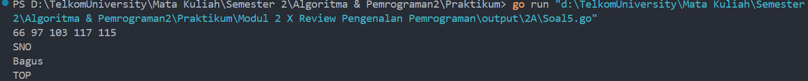
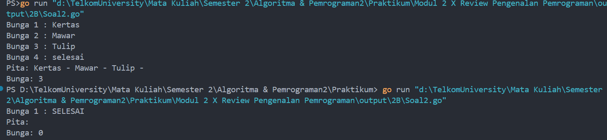
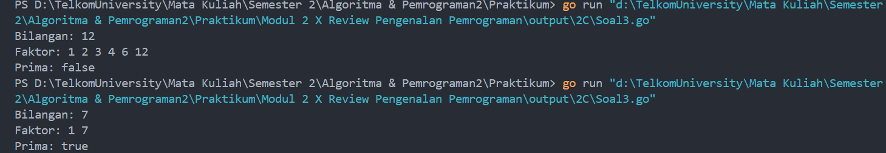

# <h1 align="center">Laporan Praktikum Modul 2 <br> # Review Pengenalan Pemrograman</h1>
<p align="center">ABYAN RAHMAN AL FARIZ - 103112430021</p>

## Dasar Teori
___

Bahasa Go memiliki struktur yang simpel tapi tetap powerful, dengan sintaks yang tegas dan efisien. Setiap program utama wajib menggunakan package main serta mendefinisikan func main() sebagai titik awal eksekusi. Pengembangan program dalam Go dimulai dengan menulis kode dalam file berekstensi .go, lalu dikompilasi menggunakan go build, dan dieksekusi melalui terminal. Go mendukung berbagai tipe data, seperti integer, float, boolean, dan string, serta menyediakan cara deklarasi variabel yang fleksibel. Dalam hal kontrol alur, Go mengandalkan perulangan for yang bisa digunakan dalam beberapa variasi, serta menyediakan percabangan if-else dan switch-case untuk menangani logika pengambilan keputusan dengan lebih rapi.

## Unguided
___
### Soal Latihan 2A

#### Soal 1

> Telusuri program berikut dengan cara mengkompilasi dan mengeksekusi program. Silakan masukan data yang sesuai sebanyak yang diminta program. Perhatikan keluaran yang diperoleh. Coba terangkan apa sebenarnya yang dilakukan program tersebut?

```go
package main

import "fmt"

func main() {

    var (
        satu, dua, tiga string
        temp string
    )

    fmt.Print("Masukan input string: ")
    fmt.Scanln(&satu)
    fmt.Print("Masukan input string: ")
    fmt.Scanln(&dua)
    fmt.Print("Masukan input string: ")
    fmt.Scanln(&tiga)
    
    fmt.Println("Output awal = " + satu + " " + dua + " " + tiga)

    temp = satu
    satu = dua
    dua = tiga
    tiga = temp

    fmt.Println("Output akhir = " + satu + " " + dua + " " + tiga)

}
```

> Output
> 
> 

Kode di atas adalah program yang menerima tiga input string dari user, lalu menampilkannya sebelum dan sesudah dilakukan perubahan urutan.

Awalnya, program minta user buat masukin tiga kata yang disimpan di variabel satu, dua, dan tiga. Setelah itu, langsung ditampilin output awal sesuai urutan input. Nah, bagian pentingnya ada di proses penukaran urutan kata:

- Variabel **satu** dipindahin ke variabel **temp** buat sementara.
- Lalu variabel **satu** diisi nilai dari variabel **dua**.
- Variabel **dua** diisi nilai dari variabel **tiga**.
- Variabel **tiga** diisi dengan nilai awal satu yang udah disimpan di variabel **temp**.
  
Jadinya, kata pertama pindah ke posisi terakhir, kata kedua ke posisi pertama, dan kata ketiga ke posisi kedua. Setelah itu, output akhirnya ditampilkan dengan susunan baru.
#### Soal 2

> Tahun kabisat adalah tahun yang habis dibagi 400 atau habis dibagi 4 tetapi tidak habis dibagi 100. Buatlah sebuah program yang menerima input sebuah bilangan bulat dan memeriksa apakah bilangan tersebut merupakan tahun kabisat (true) atau bukan (false).

```go
package main

import "fmt"

func main() {

    var tahun int
    var kabisat bool

    fmt.Print("Masukkan tahun: ")
    fmt.Scan(&tahun)


    if tahun%400 == 0 || (tahun%4 == 0 && tahun%100 != 0) {
        kabisat = true
    } else{
        kabisat = false
    }

    fmt.Println(tahun)
    fmt.Println(kabisat)

}
```

> Output
> 

Kode di atas adalah program buat ngecek apakah suatu tahun itu tahun kabisat atau bukan.

Cara kerjanya sebagai berikut:

- User memasukan tahun lewat fmt.Scan(&tahun).
- Program akan mengecek pake rumus tahun kabisat:
    - Tahun yang habis dibagi 400 atau
    - Tahun yang habis dibagi 4 tapi tidak habis dibagi 100.
- Kalau memenuhi syarat, kabisat jadi true, kalau tidak jadi false.
- Terakhir, program akan menampilkan tahun yang dimasukin sama hasil pengecekannya (true untuk tahun kabisat, false untuk bukan).

#### Soal 3

> Buat program Bola yang menerima input jari-jari suatu bola (bilangan bulat). Tampilkan Volume dan Luas kulit bola. 𝑣𝑜𝑙𝑢𝑚𝑒𝑏𝑜𝑙𝑎 = 4 3 𝜋𝑟 3 dan 𝑙𝑢𝑎𝑠𝑏𝑜𝑙𝑎 = 4𝜋𝑟 2 (π ≈ 3.1415926535)

```go
package main
import (
    "fmt"
)

  
func main() {

    var(

        jarijari int
        volume float64
        luasbola float64
        phi float64

    )

        fmt.Print("Masukan jari-jari bola: ")
        fmt.Scan(&jarijari)


        phi = 3.1415926535


        volume = 4.0 / 3.0 * phi * float64(jarijari) * float64(jarijari) * float64(jarijari)
        luasbola = 4.0 * phi * float64(jarijari) * float64(jarijari)

        fmt.Println("Jejari =", jarijari)
        fmt.Printf("Bola dengan jejari %d memiliki volume %.4f dan luas kulit %.4f\n", jarijari, volume, luasbola)

}
```

> Output
> 

Kode di atas adalah program buat ngitung volume dan luas permukaan bola berdasarkan jari-jari yang dimasukin user.

Cara kerjanya sebagai berikut:

1. User masukin nilai jari-jari lewat fmt.Scan(&jarijari).
2. phi di-set ke **3.1415926535** biar lebih akurat.
3. Rumus volume bola: **(4/3) × π × r³** dihitung dan disimpan di volume.
4. Rumus luas permukaan bola: **4 × π × r²** dihitung dan disimpan di luasbola.
5. Hasilnya ditampilin pake fmt.Printf, biar angka desimalnya lebih rapi (%.4f buat 4 angka di belakang koma).

#### Soal 4

> Dibaca nilai temperatur dalam derajat Celsius. Nyatakan temperatur tersebut dalam Fahrenheit 𝐶𝑒𝑙𝑠𝑖𝑢𝑠 = (𝐹𝑎ℎ𝑟𝑒𝑛ℎ𝑒𝑖𝑡 − 32) × 5/9 𝑅𝑒𝑎𝑚𝑢𝑟 = 𝐶𝑒𝑙𝑐𝑖𝑢𝑠 × 4/5 𝐾𝑒𝑙𝑣𝑖𝑛 = (𝐹𝑎ℎ𝑟𝑒𝑛ℎ𝑒𝑖𝑡 + 459.67) × 5/9
```go
package main

import "fmt"

  
func main(){

    var celsius float32


    fmt.Print("Masukkan suhu dalam celcius: ")
    fmt.Scan(&celsius)

  

    fahrenheit := (celsius * 9 / 5) + 32
    reamur := (celsius * 4 / 5)
    kelvin := celsius + 273.15

    fmt.Println("Derajat Reamur:" , reamur)
    fmt.Println("Derajat Fahrenheit:" , fahrenheit)
    fmt.Println("Derajat Kelvin:" , kelvin)

}
```

> Output
> 

Kode di atas adalah program buat ngubah suhu dari Celsius ke tiga satuan lain: Reamur, Fahrenheit, dan Kelvin.

Cara kerjanya:

1. User masukin suhu dalam Celsius lewat fmt.Scan(&celsius).
2. Program akan langsung mengitung konversinya pake rumus:
    - **Fahrenheit** = `(C × 9/5) + 32`
    - **Reamur** = `C × 4/5`
    - **Kelvin** = `C + 273.15`
3. Hasil konversinya akan ditampilkan ke layar pake fmt.Println(reamur,fahrenheit,kelvin).

#### Soal 5

>Tipe karakter sebenarnya hanya apa yang tampak dalam tampilan. Di dalamnya tersimpan dalam bentuk biner 8 bit (byte) atau 32 bit (rune) saja. Halaman 10 | M o d u l P r a k t i k u m A l g o r i t m a P e m r o g r a m a n Buat program ASCII yang akan membaca 5 buat data integer dan mencetaknya dalam format karakter. Kemudian membaca 3 buah data karakter dan mencetak 3 buah karakter setelah karakter tersebut (menurut tabel ASCII) Masukan terdiri dari dua baris. Baris pertama berisi 5 buah data integer. Data integer mempunyai nilai antara 32 s.d. 127. Baris kedua berisi 3 buah karakter yang berdampingan satu dengan yang lain (tanpa dipisahkan spasi). Keluaran juga terdiri dari dua baris. Baris pertama berisi 5 buah representasi karakter dari data yang diberikan, yang berdampingan satu dengan lain, tanpa dipisahkan spasi. Baris kedua berisi 3 buah karakter (juga tidak dipisahkan oleh spasi).

```go
package main

import "fmt"

func main() {

    var angka1, angka2, angka3, angka4, angka5 int
    var huruf1, huruf2, huruf3 rune


    fmt.Scan(&angka1, &angka2, &angka3, &angka4, &angka5)
    fmt.Scanln()
    fmt.Scanf("%c%c%c\n", &huruf1, &huruf2, &huruf3)
    
    
    huruf1 += 1
    huruf2 += 1
    huruf3 += 1


    fmt.Printf("%c%c%c%c%c\n", angka1, angka2, angka3, angka4, angka5)
    fmt.Printf("%c%c%c\n", huruf1, huruf2, huruf3)

}
```

> Output
> 

Kode di atas adalah program buat menerima input angka dan huruf, lalu memprosesnya sebelum menampilkan output.

Cara kerjanya:

1. Program baca **5 angka** dari input dan simpan ke variabel angka1 sampai angka5.
2. fmt.Scanln() dipakai buat menangani enter setelah input angka.
3. Program baca **3 karakter** menggunakan fmt.Scanf("%c%c%c\n", &huruf1, &huruf2, &huruf3).
4. Masing-masing huruf dinaikin 1 tingkat dalam ASCII (huruf1 += 1, dst.), jadi kalau inputnya 'A', hasilnya jadi 'B'.
5. **Output pertama** akan menampilkan angka dalam format karakter (%c), jadi angka yang diinput bakal dikonversi ke karakter ASCII.
6. **Output kedua** menampilkan huruf yang udah dinaikin 1 level.

Intinya, program ini mainin konversi angka ke karakter ASCII dan geser huruf ke karakter selanjutnya.

### Soal Latihan 2B

#### Soal 1

> Telusuri program berikut dengan cara mengkompilasi dan mengeksekusi program. Silakan masukan data yang sesuai sebanyak yang diminta program. Perhatikan keluaran yang diperoleh. Coba terangkan apa sebenarnya yang dilakukan program tersebut?

```go
package main

import "fmt"  

func main() {

    var a,b,c,d string
    var berhasil bool

    berhasil = true

  
    for i := 1; i <= 5; i++ {
        fmt.Print("Percobaan", i, ": ")
        fmt.Scan(&a,&b,&c,&d)
        if !(a == "merah" && b == "kuning" && c == "hijau" && d == "ungu") {
            berhasil = false
        }
    }

    fmt.Print("BERHASIL:", berhasil)

}
```

> Output
> 
> 

Kode di atas adalah program buat ngecek apakah user bisa masukin empat warna dengan urutan yang benar dalam lima kali percobaan.

Cara kerjanya:

1. Variabel berhasil di-set true dari awal.
2. Loop for jalan **5 kali** untuk mengambil input empat warna (a, b, c, d).
3. Setiap input dicek, apakah **harus berurutan "merah", "kuning", "hijau", "ungu"**: Kalau **salah sekali aja**, variabel berhasil diubah jadi false.
4. Setelah lima percobaan, hasil akhirnya ditampilin (BERHASIL: true kalau semua percobaan bener, false kalau ada yang salah).
   
#### Soal 2

> Suatu pita (string) berisi kumpulan nama-nama bunga yang dipisahkan oleh spasi dan ‘– ‘, contoh pita diilustrasikan seperti berikut ini. Pita: mawar – melati – tulip – teratai – kamboja – anggrek Buatlah sebuah program yang menerima input sebuah bilangan bulat positif (dan tidak nol) N, kemudian program akan meminta input berupa nama bunga secara berulang sebanyak N kali dan nama tersebut disimpan ke dalam pita. (Petunjuk: gunakan operasi penggabungan string dengan operator “+” ). Tampilkan isi pita setelah proses input selesai. Modifikasi program sebelumnya, proses input akan berhenti apabila user mengetikkan ‘SELESAI’. Kemudian tampilkan isi pita beserta banyaknya bunga yang ada di dalam pita.

```go
package main

import "fmt"


func main() {


    var bunga, pita string
    var jumlah int
  
    jumlah = 0


    for{
        fmt.Print("Bunga ", jumlah + 1, " : ")
        fmt.Scan(&bunga)
  
        if bunga == "selesai" || bunga =="SELESAI" {
        break
        }  

        pita = pita + bunga + " - "
        jumlah++
    }

    fmt.Println("Pita:", pita)
    fmt.Println("Bunga:", jumlah)

}
```

> Output
> 
> 

Kode di atas adalah program untuk menginputkan nama bunga satu per satu, lalu ngegabungin semua nama bunga jadi satu string dengan pemisah " - ".

Cara kerjanya:

1. Variabel jumlah mulai dari **0** untuk menghitung berapa banyak bunga yang akan dimasukkan.
2. Loop **akan terus berjalan** sampai user memasukkan "selesai" atau "SELESAI".
3. Setiap user input bunga akan ditambahin ke variabel pita, dengan format "bunga1 - bunga2 - bunga3 - ...".
4. Kalau user ketik "selesai", program **berhenti** (break).
5. Terakhir, program nampilin hasil akhir:
    - pita buat list bunga yang sudah diinput.
    - jumlah buat total bunga yang sudah dimasukkan.

Intinya, program ini bertujuan untuk menyimpan daftar bunga yang diinput user sampai mereka mutusin buat berhenti.

#### Soal 3

> Setiap hari Pak Andi membawa banyak barang belanjaan dari pasar dengan mengendarai sepeda motor. Barang belanjaan tersebut dibawa dalam kantong terpal di kiri-kanan motor. Sepeda motor tidak akan oleng jika selisih berat barang di kedua kantong sisi tidak lebih dari 9 kg. Buatlah program Pak Andi yang menerima input dua buah bilangan real positif yang menyatakan berat total masing-masing isi kantong terpal. Program akan terus meminta input bilangan tersebut hingga salah satu kantong terpal berisi 9 kg atau lebih. Pada modifikasi program tersebut, program akan menampilkan true jika selisih kedua isi kantong lebih dari atau sama dengan 9 kg. Program berhenti memproses apabila total berat isi kedua kantong melebihi 150 kg atau salah satu kantong beratnya negatif.

```go
package main 

import "fmt"

func main() {  

    var kantong1, kantong2 float64

    for{
        fmt.Print("Masukkan berat kantong 1: ")
        fmt.Scan(&kantong1)
        fmt.Print("Masukkan berat kantong 2: ")
        fmt.Scan(&kantong2)

        if kantong1+kantong2 > 150 {
            fmt.Println("Proses selesai.")
            break
        }

        if kantong1 < 0 || kantong2 < 0 {
            fmt.Println("Proses selesai.")
            break
        }

        selisih := kantong1 - kantong2
        if selisih < 0 {
            selisih = -selisih
        }

        if selisih >= 9 {
            fmt.Println("Sepeda motor pak Andi akan oleng: true")
        } else {
            fmt.Println("Sepeda motor pak Andi akan oleng: false")
        }
    }  

}
```

> Output
> 
> 

Kode di atas adalah program buat ngecek apakah sepeda motor Pak Andi bakal oleng berdasarkan perbedaan berat dua kantong yang dibawa.

Cara kerjanya:

1. **Loop akan berjalan terus** sampai ada kondisi buat berhenti.
2. User masukin **berat kantong 1 & kantong 2** lewat fmt.Scan(&kantong1), fmt.Scan(&kantong2).
3. Ada dua kondisi ketika **berhenti** (break):
    - Kalau total berat **lebih dari 150 kg**.
    - Kalau ada salah satu kantong**beratnya negatif** 
4. Selisih antara dua kantong dihitung (selisih := kantong1 - kantong2).
    - Kalau hasilnya negatif, dibalik (selisih = -selisih).
5. **Cek apakah selisih ≥ 9 kg**:
    - **True** → Sepeda motor akan oleng.
    - **False** → Aman, tidak oleng.
      
Jadi, program ini bisa dipakai buat ngecek keseimbangan muatan motor berdasarkan berat kantong yang dibawa.

#### Soal 4

> Diberikan sebuah persamaan sebagai berikut ini. 𝑓(𝑘) = (4𝑘 + 2) 2 / (4𝑘 + 1)(4𝑘 + 3) Buatlah sebuah program yang menerima input sebuah bilangan sebagai K, kemudian menghitung dan menampilkan nilai f(K) sesuai persamaan di atas. √2 merupakan bilangan irasional. Meskipun demikian, nilai tersebut dapat dihampiri dengan rumus berikut: √2 = ∏ (4𝑘 + 2) 2 / (4𝑘 + 1)(4𝑘 + 3) ∞ 𝑘=0 Modifikasi program sebelumnya yang menerima input integer 𝐾 dan menghitung √2 untuk 𝐾 tersebut. Hampiran √2 dituliskan dalam ketelitian 10 angka di belakang koma.

```go
package main

import (
    "math"
    "fmt"
)

func main() {
  
    var k int
  
    fmt.Print("Masukkan nilai k: ")
    fmt.Scan(&k)

    result:=1.0  

    for i:=0; i < k; i++ {
        numerator:=math.Pow(float64(4*i+2),2)
        denumerator:=float64((4*i+1)*(4*i+3))

        result *= numerator/denumerator
    }

    fmt.Printf("Hasil dari operasi fungsi = %.10f\n", result)

}```

> Output
> 
> 

Kode di atas adalah program buat ngitung hasil dari operasi fungsi menggunakan iterasi sebanyak **k** kali.

Cara kerjanya:

1. User memasukan nilai **k** (jumlah iterasi).
2. **result mulai dari 1.0** sebagai nilai awal.
3. Loop jalan dari **0 sampai k-1**, terus setiap iterasi:
    - numerator dihitung sebagai **(4i + 2)²**.
    - denumerator dihitung sebagai **(4i + 1) × (4i + 3)**.
    - result dikali dengan **numerator / denumerator**.
4. Hasil akhirnya ditampilin dengan **10 angka di belakang koma** (`%.10f`).
   

### Soal Latihan 2C

#### Soal 1

> Telusuri program berikut dengan cara mengkompilasi dan mengeksekusi program. Silakan masukan data yang sesuai sebanyak yang diminta program. Perhatikan keluaran yang diperoleh. Coba terangkan apa sebenarnya yang dilakukan program tersebut?

```go
package main

import "fmt"

func main() {  

    var beratGram int
  
    fmt.Print("Masukkan berat parsel dalam satuan gram: ")
    fmt.Scan(&beratGram)

    kg := beratGram / 1000
    sisaGram := beratGram % 1000

    biayaPerKg := 10000
    totalBiaya := kg * biayaPerKg
    sisaBiaya := 0

  
    if kg > 10 {
        sisaBiaya = 0
    } else {
        if sisaGram >= 500 {
            sisaBiaya = sisaGram * 5
        } else if sisaGram < 500{
            sisaBiaya = sisaGram * 15
        }
    }

    totalBiaya = totalBiaya + sisaBiaya

    fmt.Printf("Detail berat: %d kg + %d gr\n", kg, sisaGram)
    fmt.Printf("Detail biaya: Rp. %d + Rp. %d\n", kg*biayaPerKg, sisaBiaya)
    fmt.Printf("Total biaya: Rp. %d\n", totalBiaya)
}
```

> Output
> 
> 

Kode di atas adalah program buat ngitung biaya pengiriman parsel berdasarkan beratnya dalam gram.

Cara kerjanya:

1. **User memasukkan berat parsel dalam gram**.
2. Program akan mengkonversi ke variabel kilogram (kg) dan variabel sisa gram (sisaGram).
3. **Hitung biaya utama**:
    - Setiap **1 kg = Rp. 10.000**
    - Jadi, **totalBiaya = kg * 10.000**
4. **Hitung biaya tambahan dari sisa gram**:
    - Kalau **berat lebih dari 10 kg**, **gratis** (sisaBiaya = 0).
    - Kalau **sisa gram ≥ 500**, biaya tambahan **= sisaGram * 5**.
    - Kalau **sisa gram** < 500, biaya tambahan = **sisaGram * 15**
5. **Total biaya dihitung** dan ditampilkan detailnya


#### Soal 2

> Jawablah pertanyaan-pertanyaan berikut: a. Jika nam diberikan adalah 80.1, apa keluaran dari program tersebut? Apakah eksekusi program tersebut sesuai spesifikasi soal? b. Apa saja kesalahan dari program tersebut? Mengapa demikian? Jelaskan alur program seharusnya! c. Perbaiki program tersebut! Ujilah dengan masukan: 93.5; 70.6; dan 49.5. Seharusnya keluaran yang diperoleh adalah ‘A’, ‘B’, dan ‘D’.

**Kode Awal**

``` go
package main 

import “fmt”

func main() { 

	var nam float64 
	var nmk string

	fmt.Print(“Nilai akhir mata kuliah: “) 
	fmt.Scanln(&nam) 
		if nam > 80 { 
			nam = “A”
		} 
		if nam > 72.5 { 
			nam = “AB”
		} 
		if nam > 65 { 
			nam = “B”
		} 
		if nam > 57.5 { 
			nam = “BC”
		} 
		if nam > 50 { 
			nam = “C”
		} 
		if nam > 40 { 
			nam = “D”
		} else if nam <= 40 { 
			nam = “E”
		} 
		
		fmt.Println(“Nilai mata kuliah: “, nmk) }
```
```go
```

Kode Setelah Perbaikan

```go
package main

import (
    "fmt"
)

func main() {
    var nam float64
    var nmk string

    fmt.Print("Nilai akhir mata kuliah: ")
    fmt.Scan(&nam)

    if nam > 80 {
        nmk = "A"
    } else if nam > 72.5 {
        nmk = "AB"
    } else if nam > 65 {
        nmk = "B"
    } else if nam > 57.5 {
        nmk = "BC"
    } else if nam > 50 {
        nmk = "C"
    } else if nam > 40 {
        nmk = "D"
    } else {
        nmk = "E"
    }

    fmt.Println("Nilai mata kuliah:", nmk)

}
```
> Output
> 
> 

a. Jika `nam` diberikan adalah 80.1, apa keluaran dari program tersebut? Apakah eksekusi program tersebut sesuai spesifikasi soal?

Jawab: Ketika program awal dijalankan, output yang ditambilkan tidak sesuai dengan kriteria. Dikarenakan terdapat beberapa kesalahan pada program yang harus diperbaiki.

b. Apa saja kesalahan dari program sebelumnya? Mengapa demikian? Jelaskan alur program seharusnya!

Jawab: Struktur if yang kurang tepat, ketika Kondisi if **tidak menggunakan else if**, sehingga jika `nam > 80`, variabel `nmk` akan di-set `"A"`, **tetapi tetap masuk ke kondisi berikutnya**. Program awalnya menuliskan nam = "A", padahal nam bertipe **float64**, bukan string. Seharusnya nilai huruf disimpan dalam variabel nmk yang bertipe **string**. Setelah semua kondisi dicek, program tetap mencetak fmt.Println("Nilai mata kuliah:", nmk), padahal nmk **tidak pernah diubah** di dalam `if`.

c. Perbaiki program tersebut! Ujilah dengan masukan: 93.5; 70.6; dan 49.5. Seharusnya keluaran yang diperoleh adalah ‘A’, ‘B’, dan ‘D’.

Jawab: Setelah program diperbaiki, output yang ditampilkan sudah sesuai dengan yang tertera.


#### Soal 3

> Sebuah bilangan bulat b memiliki faktor bilangan f > 0 jika f habis membagi b. Contoh: 2 merupakan faktor dari bilangan 6 karena 6 habis dibagi 2. Buatlah program yang menerima input sebuah bilangan bulat b dan b > 1. Program harus dapat mencari dan menampilkan semua faktor dari bilangan tersebut! Bilangan bulat b > 0 merupakan bilangan prima p jika dan hanya jika memiliki persis dua faktor bilangan saja, yaitu 1 dan dirinya sendiri. Lanjutkan program sebelumnya. Setelah menerima masukan sebuah bilangan bulat b > 0. Program tersebut mencari dan menampilkan semua faktor bilangan tersebut. Kemudian, program menentukan apakah b merupakan bilangan prima.

```go
package main

import "fmt"

func main() {

    var b, faktor int
    var prima bool

    fmt.Print("Bilangan: ")
    fmt.Scan(&b)

    fmt.Print("Faktor: ")
    for i := 1; i <= b; i++ {
    
        if b%i == 0 {
            fmt.Print(i, " ")
            faktor++
        }

    }

    fmt.Println()

    if faktor == 2 {
        prima = true
    } else {
        prima = false
    }

    fmt.Println("Prima:", prima)
}
```

> Output
> 
> 

Kode ini digunakan untuk **menentukan faktor-faktor** dari sebuah bilangan `b` dan mengecek apakah `b` merupakan **bilangan prima**.

 Cara kerjanya:
1. Program menerima **input bilangan dari variabel b** dari user.
2. Program **mencari semua faktor `b`** dengan melakukan perulangan dari `1` sampai b:
    - Jika b habis dibagi i, maka i adalah faktor b.
    - Setiap faktor yang ditemukan akan ditampilkan dan faktor akan dihitung.
3. Jika jumlah faktor **sama dengan 2** (hanya `1` dan b sendiri), maka `b` adalah **bilangan prima** (prima = true).
4. Jika jumlah faktor lebih dari 2, maka nilai dari variabel b **bukan bilangan prima** (prima = false).
5. Hasil akhir dicetak dalam format **"Prima: true"** atau **"Prima: false"**.

[^1]: 
