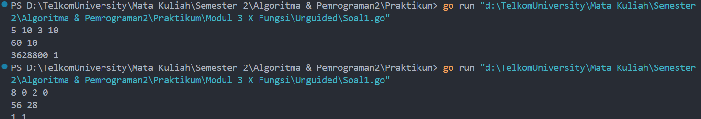
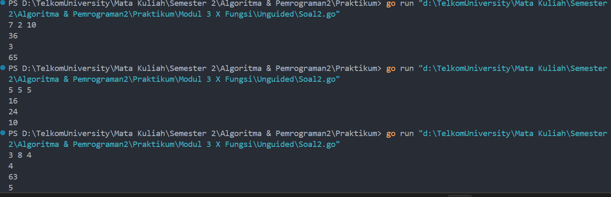
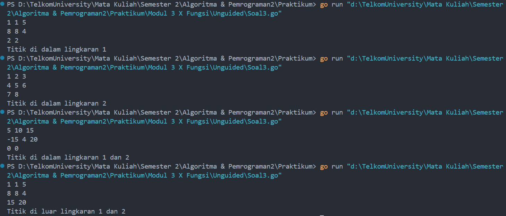

# <h1 align="center">Laporan Praktikum Modul 3 <br>  Fungsi</h1>
<p align="center">ABYAN RAHMAN AL FARIZ - 103112430021</p>

## Dasar Teori
___

Fungsi dalam pemrograman bahasa Go adalah blok kode yang dapat digunakan kembali untuk melakukan tugas tertentu. Fungsi didefinisikan dengan kata kunci func, diikuti oleh nama fungsi, parameter, tipe return, dan blok kode yang dieksekusi saat fungsi dipanggil.

## Unguided
___
#### Soal 1

> Minggu ini, mahasiswa Fakultas Informatika mendapatkan tugas dari mata kuliah matematika diskrit untuk mempelajari kombinasi dan permutasi. Jonas salah seorang mahasiswa, iseng untuk mengimplementasikannya ke dalam suatu program. Oleh karena itu bersediakah kalian membantu Jonas? (tidak tentunya ya :p)

> Masukan terdiri dari empat buah bilangan asli 𝑎, 𝑏, 𝑐, dan 𝑑 yang dipisahkan oleh spasi, dengan syarat 𝑎 ≥ 𝑐 dan 𝑏 ≥ 𝑑.

> Keluaran terdiri dari dua baris. Baris pertama adalah hasil permutasi dan kombinasi 𝒂 terhadap 𝑐, sedangkan baris kedua adalah hasil permutasi dan kombinasi 𝑏 terhadap 𝑑.

```go
package main

import "fmt"

  

func faktorial(n int) int {
    hasil := 1
    for i := 1; i <= n; i++ {
        hasil *= i
    }

    return hasil

}  

func permutasi(n, r int) int {
    return faktorial(n) / faktorial(n-r)
}


func kombinasi(n, r int) int {
    return faktorial(n) / (faktorial(r) * faktorial(n-r))
}


func main() {
    var a, b, c, d int
    fmt.Scan(&a, &b, &c, &d)  

    if a >= c && b >= d {
        fmt.Println(permutasi(a, c), kombinasi(a, c))
        fmt.Println(permutasi(b, d), kombinasi(b, d))
    } else {
        fmt.Println("Input tidak valid")
    }
}
```

> Output
> 
> 

Kode ini digunakan untuk **menghitung permutasi (P) dan kombinasi (C)** dari dua pasang bilangan, (a, c) dan (b, d), dengan syarat a ≥ c dan b ≥ d.

Dengan menggunakan rumus faktorial:
```
𝑃(𝑛, 𝑟) = 𝑛! / (𝑛−𝑟)!
```

Dan rumus kombinasi:
```
𝐶(𝑛, 𝑟) = 𝑛! / 𝑟!(𝑛−𝑟)!
```

#### **Alur Program:**

1. **Membuat function faktorial(n int) int**
    - Menghitung faktorial n! dengan cara mengalikan angka dari 1 sampai n`.
2. **Membuat fungsi permutasi(n, r int) int**
    - Menggunakan rumus **P(n, r) = n! / (n-r)!**.
3. **Membuat fungsi kombinasi(n, r int) int**
    - Menggunakan rumus **C(n, r) = n! / (r! (n-r)!)**.
4. **Dalam function main(), program menerima input empat bilangan (a, b, c, d).**
    - Jika a ≥ c dan b ≥ d, program akan menghitung dan menampilkan **hasil permutasi dan kombinasi** dari (a, c) serta (b, d).
    - Jika **syarat tidak terpenuhi**, program mencetak "Input tidak valid" sebagai output.
  
Jadinya, program ini membaca input angka, mengecek validitasnya, lalu menghitung nilai permutasi dan kombinasi sesuai rumus matematika. Setelah itu, hasil akhirnya ditampilkan dalam dua baris sesuai dengan pasangan angka yang diberikan.
#### Soal 2

>Diberikan tiga buah fungsi matematika yaitu 𝑓 (𝑥) = 𝑥 2 , 𝑔 (𝑥) = 𝑥 − 2 dan ℎ (𝑥) = 𝑥 + 1. Fungsi komposisi (𝑓𝑜𝑔𝑜ℎ)(𝑥) artinya adalah 𝑓(𝑔(ℎ(𝑥))). Tuliskan 𝑓(𝑥), 𝑔(𝑥) dan ℎ(𝑥) dalam bentuk function.

> Masukan terdiri dari sebuah bilangan bulat 𝑎, 𝑏 dan 𝑐 yang dipisahkan oleh spasi

> Keluaran terdiri dari tiga baris. Baris pertama adalah (𝑓𝑜𝑔𝑜ℎ)(𝑎), baris kedua (𝑔𝑜ℎ𝑜𝑓)(𝑏), dan baris ketiga adalah (ℎ𝑜𝑓𝑜𝑔)(𝑐)!

```go
package main

import "fmt"


func f(x int) int {
    return x * x
}


func g(x int) int{
    return x - 2
}


func h(x int) int{
    return x + 1
}


func main() {
    var a,b,c int

    fmt.Scan(&a, &b, &c)

    fogoh:= f(g(h(a)))
    gohof:= g(h(f(b)))
    hofog:= h(f(g(c)))

    fmt.Println(fogoh)
    fmt.Println(gohof)
    fmt.Println(hofog)
}
```

> Output
> 

### **Penjelasan Program:**

Program ini mengimplementasikan tiga fungsi matematika:

- f(x) = x^2 (fungsi kuadrat)
- g(x)=x−2 (mengurangi 2 dari input)
- h(x)=x+1 (menambah 1 ke input)

Lalu, program menerima tiga bilangan bulat (`a, b, c`) dan menghitung hasil dari tiga komposisi fungsi:

1. **(f∘g∘h)(a)** → **`fogoh = f(g(h(a)))`**
2. **(g∘h∘f)(b) → **`gohof = g(h(f(b)))`**
3. **(h∘f∘g)(c)** → **`hofog = h(f(g(c)))`**

Setelah menghitung nilai dari masing-masing komposisi, program menampilkan hasilnya satu per satu.
### **Alur Program:**

1. Program membaca tiga angka `a, b, c` sebagai input.
2. Menghitung nilai `fogoh`, `gohof`, dan `hofog` berdasarkan fungsi yang didefinisikan.
3. Menampilkan hasilnya dalam tiga baris.
  
Jadinya, program ini menjalankan komposisi fungsi sesuai aturan matematika, mengubah input dengan urutan fungsi tertentu, lalu mencetak hasil akhirnya secara berurutan.

#### Soal 3

> [Lingkaran] Suatu lingkaran didefinisikan dengan koordinat titik pusat (𝑐𝑥, 𝑐𝑦) dengan radius 𝑟. Apabila diberikan dua buah lingkaran, maka tentukan posisi sebuah titik sembarang (𝑥, 𝑦) berdasarkan dua lingkaran tersebut.

> Masukan terdiri dari beberapa tiga baris. Baris pertama dan kedua adalah koordinat titik pusat dan radius dari lingkaran 1 dan lingkaran 2, sedangkan baris ketiga adalah koordinat titik sembarang. Asumsi sumbu x dan y dari semua titik dan juga radius direpresentasikan dengan bilangan bulat.

> Keluaran berupa string yang menyatakan posisi titik "Titik di dalam lingkaran 1 dan 2", "Titik di dalam lingkaran 1", "Titik di dalam lingkaran 2", atau "Titik di luar lingkaran 1 dan 2".

```go
package main

import (
    "fmt"
    "math"
)


func jarak(a,b,c,d float64) float64 {
    return math.Sqrt(math.Pow(a-c, 2) + math.Pow(b-d, 2))
}


func didalam(cx,cy,r,x,y float64) bool {
    return jarak(cx,cy,x,y) <= r
}
  

func main() {
    var cx1,cx2,cy1,cy2,r1,r2,x,y float64
    var didalam1,didalam2 bool

    fmt.Scan(&cx1, &cy1, &r1)
    fmt.Scan(&cx2, &cy2, &r2)
    fmt.Scan(&x, &y)

    didalam1 = didalam(cx1,cy1,r1,x,y)
    didalam2 = didalam(cx2,cy2,r2,x,y)


    if didalam1 && didalam2 {
        fmt.Println("Titik di dalam lingkaran 1 dan 2")
    } else if didalam1{
        fmt.Println("Titik di dalam lingkaran 1")
    } else if didalam2{
        fmt.Println("Titik di dalam lingkaran 2")
    } else {
        fmt.Println("Titik di luar lingkaran 1 dan 2")
    }

}
```

> Output
> 

### **Penjelasan Program:**

Program ini bertujuan untuk menentukan posisi suatu titik `(x, y)` berdasarkan dua lingkaran yang diberikan. Setiap lingkaran memiliki titik pusat `(cx, cy)` dan jari-jari `r`. Program akan menentukan apakah titik tersebut berada di dalam salah satu atau kedua lingkaran, atau di luar keduanya.

### **Fungsi yang Digunakan:**

Fungsi Jarak
``` go
func jarak(a,b,c,d float64) float64 {
    return math.Sqrt(math.Pow(a-c, 2) + math.Pow(b-d, 2))
}
```

Fungsi ini digunakan untuk menghitung jarak antara dua titik dalam koordinat kartesius menggunakan rumus Euclidean Distance. Fungsi menerima empat parameter, yaitu `(a, b)` sebagai titik pertama dan `(c, d)` sebagai titik kedua.  
Pertama, selisih koordinat x dan y dihitung, lalu masing-masing dikuadratkan dengan `math.Pow()`.Hasilnya dijumlahkan, kemudian diakarkan menggunakan `math.Sqrt()`, dan akhirnya fungsi mengembalikan nilai jarak tersebut.

Fungsi didalam
```go
func didalam(cx,cy,r,x,y float64) bool {
    return jarak(cx,cy,x,y) <= r
}
```

Fungsi ini bertugas untuk menentukan apakah titik `(x, y)` terletak di dalam sebuah lingkaran dengan pusat `(cx, cy)` dan jari-jari `r`.  
Caranya, fungsi memanggil `jarak(cx, cy, x, y)`, lalu membandingkan hasilnya dengan `r`. Jika jaraknya lebih kecil atau sama dengan jari-jari, maka titik dianggap berada di dalam lingkaran dan fungsi mengembalikan `true`. Sebaliknya, jika jarak lebih besar dari `r`, fungsi mengembalikan `false`.

### **Alur Program:**

1. **Input**
    
    - Program membaca tiga baris input:
        1. **Koordinat dan jari-jari lingkaran 1**: `(cx1, cy1, r1)`
        2. **Koordinat dan jari-jari lingkaran 2**: `(cx2, cy2, r2)`
        3. **Koordinat titik sembarang**: `(x, y)`
2. **Cek Posisi Titik**
    
    - Menggunakan fungsi `didalam()`, program menentukan apakah titik berada di dalam masing-masing lingkaran.
    - Jika `didalam1` dan `didalam2` bernilai `true`, titik berada di dalam kedua lingkaran.
    - Jika hanya `didalam1` yang `true`, titik hanya di dalam lingkaran 1.
    - Jika hanya `didalam2` yang `true`, titik hanya di dalam lingkaran 2.
    - Jika keduanya `false`, titik berada di luar kedua lingkaran.
3. **Output**
    
    - Program mencetak hasil sesuai kondisi yang ditemukan.

Jadinya, program ini membaca data lingkaran dan titik, menghitung jaraknya ke pusat lingkaran, lalu menentukan apakah titik tersebut berada di dalam satu, dua, atau tidak ada lingkaran sama sekali.

[^1]:


