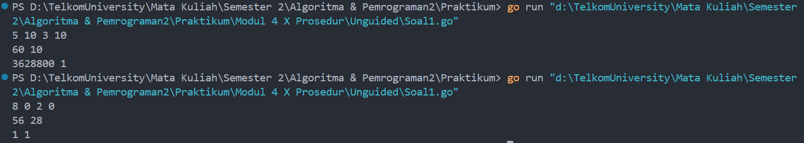
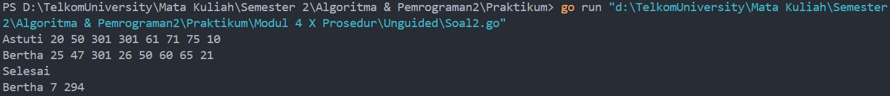
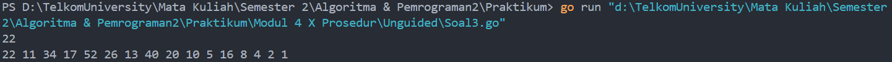

# <h1 align="center">Laporan Praktikum Modul 4 <br>  Prosedur</h1>
<p align="center">ABYAN RAHMAN AL FARIZ - 103112430021</p>

## Dasar Teori
___

Prosedur adalah **blok kode** dalam bahasa Go yang dapat digunakan kembali untuk menjalankan tugas tertentu **tanpa mengembalikan nilai**. Prosedur didefinisikan dengan kata kunci func, diikuti oleh nama prosedur, parameter (jika ada), dan blok kode yang dieksekusi saat prosedur dipanggil.

## Unguided
___
#### Soal 1

> Minggu ini, mahasiswa Fakultas Informatika mendapatkan tugas dari mata kuliah matematika diskrit untuk mempelajari kombinasi dan permutasi. Jonas salah seorang mahasiswa, iseng untuk mengimplementasikannya ke dalam suatu program. Oleh karena itu bersediakah kalian membantu Jonas? (tidak tentunya ya :p)

> Masukan terdiri dari empat buah bilangan asli 𝑎, 𝑏, 𝑐, dan 𝑑 yang dipisahkan oleh spasi, dengan syarat 𝑎 ≥ 𝑐 dan 𝑏 ≥ 𝑑.

> Keluaran terdiri dari dua baris. Baris pertama adalah hasil permutasi dan kombinasi 𝒂 terhadap 𝑐, sedangkan baris kedua adalah hasil permutasi dan kombinasi 𝑏 terhadap 𝑑.

```go
package main

import "fmt"

func factorial(n int, hasil *int) {
    *hasil = 1
    for i := 1; i <= n; i++ {
        *hasil *= i
    }
}


func permutation(n, r int, hasil *int) {
    var factN, factNR int
    
    factorial(n, &factN)
    factorial(n-r, &factNR)
    *hasil = factN / factNR
}

  
func combination(n,r int, hasil *int) {
    var factN, factR, factNR int

    factorial(n, &factN)
    factorial(r, &factR)
    factorial(n-r, &factNR)
    *hasil = factN / (factR * factNR)
}

  
func main() {
    var a,b,c,d int
    var permutasiA, permutasiB, kombinasiA, kombinasiB int

    fmt.Scan(&a, &b, &c, &d)

    if a >= c && b >= d {
        permutation(a, c, &permutasiA)
        combination(a, c, &kombinasiA)
        permutation(b, d, &permutasiB)
        combination(b, d, &kombinasiB)
        fmt.Println(permutasiA, kombinasiA)
        fmt.Println(permutasiB, kombinasiB)
    } else{
        fmt.Println("Input tidak valid")
    }

}```

> Output
> 
> 

### **Penjelasan Program:**

Program ini bertujuan untuk menghitung **permutasi dan kombinasi** dari dua pasang bilangan (a, c) dan (b, d), dengan syarat a ≥ c dan b ≥ d. Program akan menampilkan dua baris output, di mana baris pertama adalah hasil permutasi dan kombinasi **a terhadap c**, dan baris kedua adalah hasil permutasi dan kombinasi **b terhadap d**.

### **Prosedur yang Digunakan:**

Prosedur Factorial
``` go
func factorial(n int, hasil *int) {
    *hasil = 1
    for i := 1; i <= n; i++ {
        *hasil *= i
    }
}
```

**Prosedur factorial** digunakan untuk menghitung faktorial dari suatu bilangan n. Prosedur ini menerima dua parameter, yaitu n sebagai bilangan yang akan dihitung faktorialnya, dan hasil sebagai pointer yang akan menyimpan hasil perhitungan. Awalnya, hasil diinisialisasi dengan 1, lalu dilakukan perulangan dari 1 hingga n untuk mengalikan nilai hasil dengan setiap angka dalam rentang tersebut.

Prosedur Permutation
```go
func permutation(n, r int, hasil *int) {
    var factN, factNR int
    factorial(n, &factN)
    factorial(n-r, &factNR)
    *hasil = factN / factNR
}
```

**Prosedur permutation** digunakan untuk menghitung permutasi berdasarkan rumus P(n,r)=n! / (n−r)!. Prosedur ini pertama-tama memanggil factorial() untuk menghitung n! dan (n-r)!, lalu hasil permutasi diperoleh dengan membagi n! dengan (n-r)!.

Prosedur Combination
```go
func combination(n, r int, hasil *int) {
    var factN, factR, factNR int
    factorial(n, &factN)
    factorial(r, &factR)
    factorial(n-r, &factNR)
    *hasil = factN / (factR * factNR)
}
```

**Prosedur combination** digunakan untuk menghitung kombinasi dengan rumus C(n,r)=n! / r!(n−r)!. Dalam prosedur ini, factorial() dipanggil tiga kali untuk menghitung n!, r!, dan (n-r)!. Hasil kombinasi kemudian diperoleh dengan membagi n! dengan hasil perkalian r! dan (n-r)!.

### **Alur Program:**

1. **Input**
    
    - Program membaca empat bilangan a, b, c, d menggunakan fmt.Scan().
	- Memeriksa apakah a ≥ c dan b ≥ d. Jika tidak, program menampilkan **"Input tidak valid"**.
2. **Hitung Permutasi dan Kombinasi**

	- Jika a ≥ c` dan `b ≥ d, program memanggil permutation() dan combination() untuk kedua pasangan angka tersebut.
3. **Output**
    
    - Program mencetak hasil permutasi dan kombinasi untuk (a, c) di baris pertama.
	- Program mencetak hasil permutasi dan kombinasi untuk (b, d) di baris kedua.

Jadi, program ini membaca input, memverifikasi syaratnya, menghitung permutasi dan kombinasi dengan prosedur, lalu mencetak hasilnya dalam dua baris.

#### Soal 2

>Kompetisi pemrograman tingkat nasional berlangsung ketat. Setiap peserta diberikan 8 soal yang harus dapat diselesaikan dalam waktu 5 jam saja. Peserta yang berhasil menyelesaikan soal paling banyak dalam waktu paling singkat adalah pemenangnya. Buat program gema yang mencari pemenang dari daftar peserta yang diberikan. Program harus dibuat modular, yaitu dengan membuat prosedur hitungSkor yang mengembalikan total soal dan total skor yang dikerjakan oleh seorang peserta, melalui parameter formal. Pembacaan nama peserta dilakukan di program utama, sedangkan waktu pengerjaan dibaca di dalam prosedur.

``` go
prosedure hitungSkor(in/out soal, skor : integer)
```

>Setiap baris **masukan** dimulai dengan satu string nama peserta tersebut diikuti dengan adalah 8 integer yang menyatakan berapa lama (dalam menit) peserta tersebut menyelesaikan soal. Jika tidak berhasil atau tidak mengirimkan jawaban maka otomatis dianggap menyelesaikan dalam waktu 5 jam 1 menit (301 menit).

> Satu baris **keluaran** berisi nama pemenang, jumlah soal yang diselesaikan, dan nilai yang diperoleh. Nilai adalah total waktu yang dibutuhkan untuk menyelesaikan soal yang berhasil diselesaikan.

```go
package main

import (
    "fmt"
    "math"
)

func hitungSkor(soal *int, skor *int) {
    *soal = 0
    *skor = 0

    var waktu int
    
    for i := 0; i < 8; i++ {
        fmt.Scan(&waktu)
        if waktu < 301 {
            *soal += 1
            *skor += waktu
        }
    }
}

  
func main() {
    var nama, pemenang string
    var soal, skor int
    var maxSoal, minSkor int = -1, math.MaxInt32

    for {
        fmt.Scan(&nama)
        if nama == "Selesai" {
            break
        }

        hitungSkor(&soal, &skor)

        if soal > maxSoal || (soal == maxSoal && skor < minSkor) {
            maxSoal = soal
            minSkor = skor
            pemenang = nama
        }
    }
    fmt.Println(pemenang, maxSoal, minSkor)
}
```

> Output
> 

### **Penjelasan Program:**

Program ini bertujuan untuk menentukan **pemenang kompetisi pemrograman** berdasarkan jumlah soal yang diselesaikan dan total waktu yang digunakan. Setiap peserta mengerjakan **8 soal**, dan jika tidak menyelesaikan soal, maka waktu dianggap **301 menit** (lebih dari batas 5 jam). Pemenang ditentukan berdasarkan jumlah soal yang berhasil diselesaikan terbanyak, dan jika ada lebih dari satu peserta dengan jumlah soal yang sama, pemenang adalah peserta dengan total waktu terkecil.

### **Prosedur yang Digunakan:**

Prosedur hitungSkor
``` go
func hitungSkor(soal *int, skor *int) {
    *soal = 0
    *skor = 0

    var waktu int

    for i := 0; i < 8; i++ {
        fmt.Scan(&waktu)
        if waktu < 301 {
            *soal += 1
            *skor += waktu
        }
    }
}
```

**Prosedur hitungSkor** digunakan untuk menghitung jumlah soal yang berhasil diselesaikan dan total waktu yang digunakan oleh seorang peserta. Prosedur ini menerima dua parameter, yaitu soal dan skor, yang bertindak sebagai **pass by reference** agar hasilnya bisa dikembalikan ke fungsi pemanggilnya. Awalnya, soal dan skor diinisialisasi ke nol. Program kemudian membaca 8 angka yang merepresentasikan waktu penyelesaian masing-masing soal. Jika waktu penyelesaian soal kurang dari **301 menit**, maka soal dianggap selesai, dan waktu tersebut ditambahkan ke total skor.
### **Alur Program:**

1. **Input Data Peserta**
    
    - Program membaca nama peserta di dalam main().
    - Jika nama yang dimasukkan adalah "Selesai", program berhenti membaca input.
2. **Menghitung Skor dan Soal yang Diselesaikan**
    
    - Memanggil hitungSkor(&soal, &skor) untuk menghitung jumlah soal yang berhasil diselesaikan dan total waktu yang digunakan.
3. **Menentukan Pemenang**

    - Jika peserta saat ini memiliki jumlah soal lebih banyak dari pemenang sebelumnya, maka peserta tersebut menjadi pemenang sementara.
    - Jika jumlah soal sama, peserta dengan total waktu lebih kecil yang menjadi pemenang.
4. **Menampilkan Pemenang**

    - Setelah semua data peserta dibaca, program mencetak nama pemenang, jumlah soal yang diselesaikan, dan total waktu yang digunakan.
  
Program ini membaca nama peserta, menghitung jumlah soal yang berhasil diselesaikan serta total waktu pengerjaan soal, lalu menentukan pemenang berdasarkan jumlah soal terbanyak dan waktu tercepat jika jumlah soal sama.

#### Soal 3

> Skiena dan Revilla dalam Programming Challenges mendefinisikan sebuah deret bilangan. Deret dimulai dengan sebuah bilangan bulat n. Jika bilangan n saat itu genap, maka suku berikutnya adalah ½n, tetapi jika ganjil maka suku berikutnya bernilai 3n+1. Rumus yang sama digunakan terus menerus untuk mencari suku berikutnya. Deret berakhir ketika suku terakhir bernilai 1. Untuk suku awal sampai dengan 1000000, diketahui deret selalu mencapai suku dengan nilai 1.
> 
> Buat program skiena yang akan mencetak setiap suku dari deret yang dijelaskan di atas untuk nilai suku awal yang diberikan. Pencetakan deret harus dibuat dalam prosedur cetakDeret yang mempunyai 1 parameter formal, yaitu nilai dari suku awal.

``` go
prosedure cetakDeret(in n : integer )
```

> Masukan berupa satu bilangan integer positif yang lebih kecil dari 1000000.

> Keluaran terdiri dari satu baris saja. Setiap suku dari deret tersebut dicetak dalam baris yang dan dipisahkan oleh sebuah spasi.

```go
package main

import "fmt"


func cetakDeret (n int) {
    for n != 1 {
        fmt.Print(n, " ")
        if n%2 == 0 {
            n /= 2
        } else {
            n = 3*n + 1
        }
    }
    fmt.Print(1)
}
  

func main() {
    var n int

    fmt.Scan(&n)

    if n > 0 && n < 1000000 {
        cetakDeret(n)
    }
}
```

> Output
> 

### **Penjelasan Program:**

Program ini digunakan untuk **mencetak deret bilangan Skiena** berdasarkan aturan:

- Jika n adalah **genap**, maka suku berikutnya adalah n / 2.
- Jika n adalah **ganjil**, maka suku berikutnya adalah 3n + 1.
- Deret **berhenti** saat nilai n mencapai **1**.

Program menerima satu bilangan bulat positif (n) yang **kurang dari 1.000.000** sebagai input, lalu mencetak deret hingga mencapai angka 1 dalam satu baris.

### **Prosedur yang Digunakan:**

Prosedur cetakDeret
``` go
func cetakDeret (n int) {
    for n != 1 {
        fmt.Print(n, " ")
        if n%2 == 0 {
            n /= 2
        } else {
            n = 3*n + 1
        }
    }
    fmt.Print(1)
}
```

**Prosedur cetakDeret** bertanggung jawab untuk mencetak deret bilangan Skiena dari nilai n yang diberikan hingga mencapai angka **1**.  
Di dalam prosedur ini, dilakukan perulangan untuk setiap suku dalam deret. Jika n genap, nilai n dibagi **2**. Jika n ganjil, nilai n diubah menjadi 3n + 1. Proses ini terus berlanjut hingga n bernilai **1**, yang kemudian dicetak sebagai angka terakhir dalam deret.

### **Alur Program:**

1.  **Input Bilangan**
    
    - Program membaca satu bilangan bulat n dengan fmt.Scan(&n).
    - Bilangan harus berada dalam rentang 1 ≤ n < 1.000.000.
2. **Mencetak Deret**
    
    - Jika n memenuhi syarat, prosedur cetakDeret(n) dipanggil.
    - Prosedur akan terus mencetak setiap suku deret hingga n menjadi **1**.
- **Output**
    
    - Semua angka dalam deret dicetak dalam **satu baris**, dipisahkan dengan spasi.

Program ini membaca nilai awal n, lalu menggunakan prosedur **cetakDeret** untuk mencetak setiap suku dalam deret Skiena hingga mencapai **1**. Semua output dicetak dalam satu baris dengan spasi sebagai pemisah.

[^1]:


