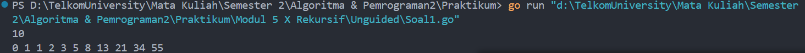
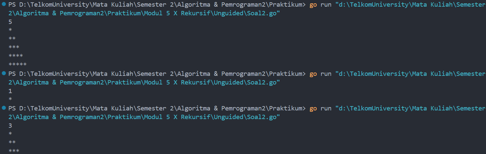
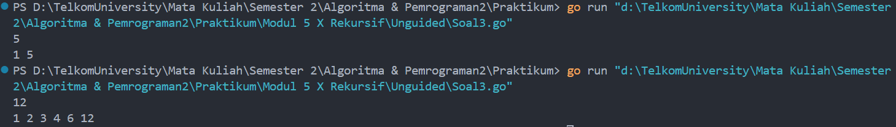
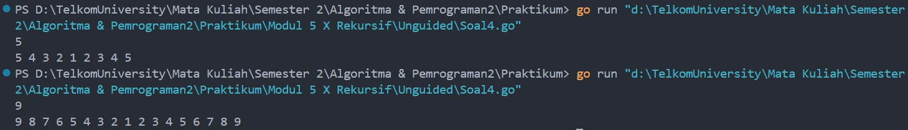
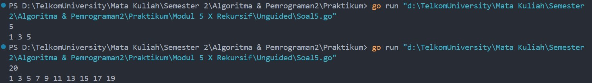
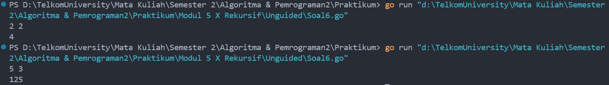

# <h1 align="center">Laporan Praktikum Modul 5 <br>  Rekursif </h1>
<p align="center">ABYAN RAHMAN AL FARIZ - 103112430021</p>

## Dasar Teori
___

Rekursif adalah teknik pemrograman di mana sebuah fungsi memanggil dirinya sendiri secara langsung atau tidak langsung untuk menyelesaikan masalah yang kompleks dengan memecahnya menjadi sub-masalah yang lebih kecil.

## Unguided
___
#### Soal 1

> Deret fibonacci adalah sebuah deret dengan nilai suku ke-0 dan ke-1 adalah 0 dan 1, dan nilai suku ke-n selanjutnya adalah hasil penjumlahan dua suku sebelumnya. Secara umum dapat diformulasikan 𝑆𝑛 = 𝑆𝑛−1 + 𝑆𝑛−2 . Berikut ini adalah contoh nilai deret fibonacci hingga suku ke-10. Buatlah program yang mengimplementasikan fungsi rekursif pada deret fibonacci tersebut.

```go
package main

import "fmt"


func fibonacci(n int) int {
    if n == 0 {
        return 0
    } else if n == 1 {
        return 1
    }
    return fibonacci(n-1) + fibonacci(n-2)
}

  
func main() {
    var n int

    fmt.Scan(&n)
  
    for i := 0; i <= n; i++ {
        fmt.Print(fibonacci(i), " ")
    }
    fmt.Println()
}
```

> Output
> 
> 

### **Penjelasan Program:**

Program ini bertujuan untuk menghitung dan menampilkan **deret Fibonacci** hingga suku ke-n menggunakan konsep **rekursif**. Program ini meminta input berupa bilangan bulat positif n dan akan mencetak bilangan Fibonacci dari suku ke-0 hingga suku ke-n. 

### **Base Case dan Recursive Case yang Digunakan:**

Base Case
``` go
if n == 0 {
        return 0
    } else if n == 1 {
        return 1
    }
```

- Jika n == 0, fungsi mengembalikan **0**.
- Jika n == 1, fungsi mengembalikan **1**.
  
Recursive Case
```go
return fibonacci(n-1) + fibonacci(n-2)
```

Untuk n >= 2, fungsi memanggil dirinya sendiri dan prosesnya akan berjalan terus hingga mencapai **base case** yang menjadi kondisi berhenti.

### **Alur Program:**

1. **Input Bilangan**
    
    - Program menerima input n, yaitu panjang deret Fibonacci yang ingin dicetak.
        
2. **Menghitung Deret Fibonacci**
    
    - Program melakukan perulangan dari 0 hingga n.
        
    - Pada setiap iterasi, program memanggil prosedur fibonacci(i) untuk menghitung suku ke-i dari deret Fibonacci.
        
3. **Output**
    
    - Hasil deret Fibonacci dicetak dalam **satu baris**, dipisahkan oleh spasi.

Program ini menggunakan **rekursi** untuk menghitung deret Fibonacci. Dengan memanfaatkan **base case** untuk menghentikan rekursi dan **recursive case** untuk menghitung suku berikutnya.

#### Soal 2

>Buatlah sebuah program yang digunakan untuk menampilkan pola bintang berikut ini dengan menggunakan fungsi rekursif. 

>N adalah masukan dari user.

```go
package main

import "fmt"

  
func polaBintang(n,baris int) {
    if baris > n {
        return
    }

    for i := 0; i < baris; i++ {
        fmt.Print("*")
    }

    fmt.Println()

    polaBintang(n, baris+1)
}


func main() {
    var n int

    fmt.Scan(&n)

    polaBintang(n,1)

}
```

> Output
> 

### **Penjelasan Program:**

Program ini bertujuan untuk **menampilkan pola bintang** secara **rekursif** berdasarkan nilai n yang dimasukkan oleh pengguna.

### **Base Case dan Recursive Case yang Digunakan:**

Base Case
``` go
if baris > n {
        return
    }
```

Jika baris > n, fungsi berhenti (mengembalikan return). Ini adalah **kondisi berhenti** agar rekursi tidak berjalan tanpa batas.

Recursive Case
``` go
for i := 0; i < baris; i++ {
        fmt.Print("*")
    }

    fmt.Println()

    polaBintang(n, baris+1)
```

Jika baris <= n, fungsi mencetak sejumlah baris bintang menggunakan for loop, lalu memanggil dirinya sendiri dengan baris + 1.

### **Alur Program:**

1. **Input Bilangan**
    
    - Program meminta pengguna memasukkan bilangan n.
        
2. **Cetak Pola Bintang Secara Rekursif**
    
    - Memanggil fungsi polaBintang(n, 1) untuk mulai mencetak bintang dari baris pertama hingga n.
        
3. **Kondisi Berhenti (Base Case)**
    
    - Jika nilai baris melebihi n, fungsi berhenti dan rekursi selesai.
  
Program ini mencetak pola bintang menggunakan pendekatan **rekursif**. Dengan memanfaatkan **base case** untuk menghentikan rekursi dan **recursive case** untuk mencetak bintang secara bertahap, program mencetak pola bintang dari baris 1 hingga n.

#### Soal 3

> Buatlah program yang mengimplementasikan rekursif untuk menampilkan faktor bilangan dari suatu N, atau bilangan yang apa saja yang habis membagi N.

>Masukan terdiri dari sebuah bilangan bulat positif N.

> Keluaran terdiri dari barisan bilangan yang menjadi faktor dari N (terurut dari 1 hingga N ya).

```go
package main

import "fmt"
  

func faktorBilangan(n, bilangan int) {
    if bilangan > n {
        return
    }

    if n%bilangan == 0 {
        fmt.Print(bilangan, " ")
    }

    faktorBilangan(n, bilangan+1)
}

  
func main() {
    var n int

    fmt.Scan(&n)

    faktorBilangan(n, 1)

}
```

> Output
> 

### **Penjelasan Program:**

Program ini digunakan untuk **menampilkan semua faktor bilangan** dari suatu bilangan bulat positif `N` menggunakan **rekursi**. Faktor bilangan adalah angka yang **habis membagi N** tanpa sisa.

### **Base Case dan Recursive Case yang Digunakan:**

Base Case
``` go
if bilangan > n {
        return
   }```

Jika bilangan melebihi n, maka fungsi berhenti (return), artinya semua faktor sudah dicek.

Recursive Case
``` go
if n%bilangan == 0 {
        fmt.Print(bilangan, " ")
    }
    
    faktorBilangan(n, bilangan+1)
   }
```

Jika n **habis dibagi** oleh variabel bilangan (n % bilangan == 0), maka angka tersebut dicetak. Setelah itu, fungsi memanggil dirinya sendiri dengan **bilangan + 1** untuk mengecek angka berikutnya.

### ### **Alur Program:**

1. **Input Bilangan**
    
    - Program membaca bilangan bulat positif n dari pengguna.
        
2. **Menentukan Faktor Bilangan Secara Rekursif**
    
    - Program memanggil fungsi faktorBilangan(n, 1) untuk memulai proses pengecekan dari **1** hingga **n**.
        
3. **Mencetak Hasil**
    
    - Jika n habis dibagi bilangan, angka tersebut akan ditampilkan.
        
    - Proses ini berlangsung secara **rekursif** hingga semua angka dari **1** hingga **n** selesai diperiksa.

Program ini menggunakan **rekursi** untuk menampilkan faktor dari bilangan bulat positif N. Dengan memanfaatkan **base case** untuk menghentikan rekursi dan **recursive case** untuk memeriksa angka satu per satu, program mencetak faktor-faktor secara berurutan dari **1** hingga **N**.

#### Soal 4

> Buatlah program yang mengimplementasikan rekursif untuk menampilkan barisan bilangan tertentu.

>Masukan terdiri dari sebuah bilangan bulat positif N.

> Keluaran terdiri dari barisan bilangan dari N hingga 1 dan kembali ke N.

```go
package main

import "fmt"

  
func barisanBilangan(n, bilangan int) {
    if bilangan < 1 {
        return
    }

    fmt.Print(bilangan, " ")  

    barisanBilangan(n, bilangan-1)

    if bilangan < n {
        fmt.Print(bilangan+1, " ")
    }
}

  
func main() {
    var n int

    fmt.Scan(&n)

    barisanBilangan(n, n)

}

```

> Output
> 

### **Penjelasan Program:**

Program ini digunakan untuk **menampilkan barisan bilangan** dari N hingga `1`, lalu kembali lagi ke N, menggunakan **rekursi**.

### **Base Case dan Recursive Case yang Digunakan:**

Base Case
``` go
if bilangan < 1 {
        return
    }
```

Jika bilangan melebihi n, maka fungsi berhenti (return), artinya semua faktor sudah dicek.

Recursive Case
``` go
barisanBilangan(n, bilangan-1)

    if bilangan < n {
        fmt.Print(bilangan+1, " ")
    }
```

**Recursive Case** pada fungsi barisanBilangan bekerja dengan memanggil fungsi itu sendiri secara **berulang** sambil mengurangi nilai bilangan sebesar **1** setiap kali pemanggilan. Setelah mencetak nilai bilangan saat ini, fungsi memanggil dirinya sendiri dengan argumen bilangan - 1. Proses ini akan terus berjalan hingga mencapai **base case**, yaitu ketika bilangan < 1.

Setelah mencapai base case, rekursi mulai **kembali (backtracking)**. Pada tahap ini, jika nilai bilangan kurang dari `n`, maka fungsi mencetak **bilangan + 1**. Bagian ini bertanggung jawab untuk mencetak bilangan dalam **urutan menaik** setelah selesai mencetak bilangan dalam **urutan menurun**.

### ### ### **Alur Program:**

1. **Input Bilangan**
    
    - Program membaca bilangan bulat positif n dari pengguna.
        
2. **Mencetak Barisan Bilangan Secara Rekursif**
    
    - Program memanggil fungsi barisanBilangan(n, n) untuk memulai mencetak dari bilangan **n** hingga **1**.
        
    - Setelah mencapai **1**, rekursi kembali ke **n** untuk mencetak bilangan secara naik.

Program ini menggunakan **rekursi** untuk mencetak barisan bilangan dari **N ke 1** dan kembali ke **N**. Dengan memanfaatkan **base case** untuk menghentikan rekursi dan **recursive case** untuk memproses bilangan turun dan naik, program dapat menghasilkan pola bilangan sesuai yang diinginkan.

#### Soal 5

>Buatlah program yang mengimplementasikan rekursif untuk menampilkan barisan bilangan ganjil.

>Masukan terdiri dari sebuah bilangan bulat positif N.

>Keluaran terdiri dari barisan bilangan ganjil dari 1 hingga N.

```go
package main

import "fmt"
  

func bilanganGanjil(n, bilangan int) {
    if bilangan > n {
        return
    }

	    if bilangan%2 != 0 {
	        fmt.Print(bilangan, " ")
	    }
	
	    bilanganGanjil(n, bilangan+1)
}


func main() {
    var n int

    fmt.Scan(&n)

    bilanganGanjil(n,1)

}
```

> Output
> 

### **Penjelasan Program:**

Program ini bertujuan untuk **menampilkan bilangan ganjil** dari **1 hingga N** menggunakan metode **rekursif**. Jika pengguna memasukkan nilai `N`, maka program akan mencetak semua bilangan ganjil dalam rentang tersebut secara berurutan.

### **Base Case dan Recursive Case yang Digunakan:**

Base Case
``` go
if bilangan > n {
        return
    }
```

Jika nilai bilangan **lebih besar dari n**, maka fungsi berhenti (return). Ini mencegah rekursi berjalan tanpa batas.

Recursive Case
``` go
if bilangan%2 != 0 {
        fmt.Print(bilangan, " ")
    }

    bilanganGanjil(n, bilangan+1)
```

Jika nilai bilangan saat ini **ganjil** (bilangan % 2 != 0), maka bilangan tersebut dicetak. Setelah mencetak (jika ganjil), fungsi memanggil dirinya sendiri dengan **bilangan + 1** untuk memeriksa angka berikutnya hingga mencapai batas n.

### ### ### ### **Alur Program:**

1. **Input Bilangan**
    
    - Program meminta pengguna memasukkan bilangan bulat positif n.
        
2. **Mencetak Bilangan Ganjil Secara Rekursif**
    
    - Program memanggil fungsi bilanganGanjil(n, 1) untuk memulai pencetakan dari **1** hingga **n**.
        
    - Jika bilangan saat ini ganjil, maka akan dicetak.
        
3. **Menghentikan Rekursi (Base Case)**
    
    - Rekursi berhenti saat nilai bilangan melebihi n.

Program ini menggunakan **rekursi** untuk mencetak bilangan ganjil dari **1 hingga N**. Dengan memanfaatkan **base case** untuk menghentikan rekursi dan **recursive case** untuk mencetak bilangan ganjil, program mencetak hasil yang sesuai dalam urutan yang benar.

#### Soal 6

> Buatlah program yang mengimplementasikan rekursif untuk mencari hasil pangkat dari dua buah bilangan.

>Masukan terdiri dari bilangan bulat x dan y.

> Keluaran terdiri dari hasil x dipangkatkan y.

> Catatan: diperbolehkan menggunakan asterik "*", tapi dilarang menggunakan import "math".

```go
package main

import "fmt"

  
func rumusPangkat(x, y int) int {
    if y == 0 {
        return 1
    }
    
    return x * rumusPangkat(x, y-1)
}

  
func main() {
    var x, y,result int

    fmt.Scan(&x, &y)

    result = rumusPangkat(x, y)
    fmt.Println(result)

}
```

> Output
> 

### **Penjelasan Program:**

Program ini digunakan untuk **menghitung hasil pangkat** dari dua bilangan bulat x dan y menggunakan **rekursi**. Program menerima dua bilangan x (basis) dan y (eksponen), lalu mengembalikan hasil dari x^y  tanpa menggunakan **package math**.

### **Base Case dan Recursive Case yang Digunakan:**

Base Case
``` go
if y == 0 {
        return 1
    }
```

Jika nilai y == 0, maka fungsi mengembalikan nilai **1**. Ini sesuai dengan konsep matematika di mana setiap bilangan yang dipangkatkan nol memiliki hasil **1**.

Recursive Case
``` go
return x * rumusPangkat(x, y-1)
```

Jika y > 0, maka fungsi mengembalikan hasil dari **x dikali hasil pemanggilan fungsi rumusPangkat(x, y-1)**. Ini berarti program terus mengalikan x dengan dirinya sendiri hingga y mencapai nol (base case).

### ### ### ### **Alur Program:**

1. **Input Bilangan**
    
    - Program meminta pengguna memasukkan dua bilangan bulat x dan y.
        
2. **Menghitung Pangkat Secara Rekursif**
    
    - Program memanggil fungsi rumusPangkat(x, y) yang akan menghitung hasil pangkat menggunakan pendekatan rekursi.
        
3. **Mencetak Hasil**
    
    - Hasil pangkat ditampilkan setelah proses rekursi selesai.

Program ini menggunakan **rekursi** untuk menghitung hasil pangkat dari dua bilangan tanpa menggunakan **package math**. Dengan memanfaatkan **base case** sebagai titik berhenti dan **recursive case** untuk melakukan perkalian berulang, program menghasilkan hasil pangkat yang benar.

[^1]:


