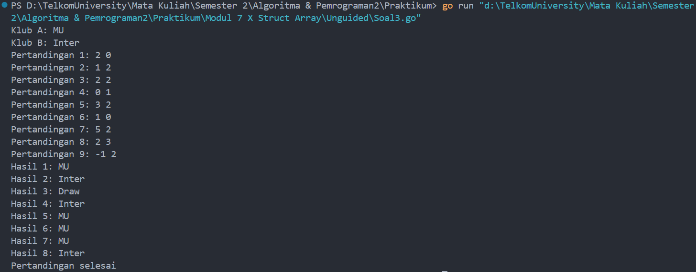

# <h1 align="center">Laporan Praktikum Modul 7 <br>  Struct Array </h1>
<p align="center">ABYAN RAHMAN AL FARIZ - 103112430021</p>

## Dasar Teori
___

**Struct** adalah tipe data bentukan (custom data type) yang memungkinkan kita mengelompokkan beberapa variabel dengan tipe data yang berbeda menjadi satu kesatuan. Struct berguna untuk merepresentasikan objek yang memiliki beberapa atribut atau properti.

**Array** adalah kumpulan elemen dengan **tipe data yang sama** dan disimpan di dalam satu variabel. Panjang array di Golang bersifat **tetap (fixed size)** dan harus didefinisikan di awal.

## Unguided
___
#### Soal 1

> Suatu lingkaran didefinisikan dengan koordinat titik pusat (𝑐𝑥, 𝑐𝑦) dengan radius 𝑟. Apabila diberikan dua buah lingkaran, maka tentukan posisi sebuah titik sembarang (𝑥, 𝑦) berdasarkan dua lingkaran tersebut. Gunakan tipe bentukan titik untuk menyimpan koordinat, dan tipe bentukan lingkaran untuk menyimpan titik pusat lingkaran dan radiusnya.

> Masukan terdiri dari beberapa tiga baris. Baris pertama dan kedua adalah koordinat titik pusat dan radius dari lingkaran 1 dan lingkaran 2, sedangkan baris ketiga adalah koordinat titik sembarang. Asumsi sumbu x dan y dari semua titik dan juga radius direpresentasikan dengan bilangan bulat.

> Keluaran berupa string yang menyatakan posisi titik "Titik di dalam lingkaran 1 dan 2", "Titik di dalam lingkaran 1", "Titik di dalam lingkaran 2", atau "Titik di luar lingkaran 1 dan 2".

```go
package main

import (
    "fmt"
    "math"
)

  
type Titik struct {
    x, y int
}

  
type Lingkaran struct {
    pusat Titik
    radius int
}

  
func jarak(p, q Titik) float64 {
    return math.Sqrt(float64((p.x-q.x)*(p.x-q.x) + (p.y-q.y)*(p.y-q.y)))
}
  

func diDalam(c Lingkaran, p Titik) bool {
    return jarak(c.pusat, p) <= float64(c.radius)
}

  
func main() {
    var l1, l2 Lingkaran
    var t Titik

    fmt.Scan(&l1.pusat.x, &l1.pusat.y, &l1.radius)
    fmt.Scan(&l2.pusat.x, &l2.pusat.y, &l2.radius)
    fmt.Scan(&t.x, &t.y)

    diDalamL1 := diDalam(l1, t)
    diDalamL2 := diDalam(l2, t)

    if diDalamL1 && diDalamL2 {
        fmt.Println("Titik di dalam lingkaran 1 dan 2")
    } else if diDalamL1 {
        fmt.Println("Titik di dalam lingkaran 1")
    } else if diDalamL2 {
        fmt.Println("Titik di dalam lingkaran 2")
    } else {
        fmt.Println("Titik di luar lingkaran 1 dan 2")
    }
}
```

> Output
> 
> 

### **Penjelasan Program:**

Program ini bertujuan untuk menentukan **posisi sebuah titik sembarang** terhadap dua lingkaran menggunakan **struct**. Program menerima input berupa koordinat titik pusat dan radius dari dua lingkaran, serta satu titik sembarang. Output yang dihasilkan berupa posisi titik terhadap lingkaran-lingkaran tersebut.

### **Struct yang Digunakan:**

Struct Titik
``` go
type Titik struct {
    x, y int
}
```

- Struct ini digunakan untuk menyimpan **koordinat** titik dalam bentuk (x, y).
  
Struct Lingkaran
```go
type Lingkaran struct {
    pusat Titik
    radius int
}
```

Struct ini digunakan untuk menyimpan:
- **pusat**: Titik pusat lingkaran (menggunakan struct Titik).
- **radius**: Jari-jari lingkaran dalam bilangan bulat.
  
### **Fungsi yang Digunakan:**

Fungsi jarak
```go
func jarak(p, q Titik) float64 {
    return math.Sqrt(float64((p.x-q.x)*(p.x-q.x) + (p.y-q.y)*(p.y-q.y)))
}
```

- **Parameter**:
    - `p` dan `q` adalah dua titik bertipe `Titik`.
- **Mengembalikan**: Jarak antara dua titik menggunakan rumus:
    Jarak= √(𝑎 − 𝑐)^2 + (𝑏 − 𝑑)^2

Fungsi diDalam
```go
func diDalam(c Lingkaran, p Titik) bool {
    return jarak(c.pusat, p) <= float64(c.radius)
}
```

- **Parameter**:
    `c` adalah lingkaran bertipe `Lingkaran`.
    `p` adalah titik sembarang bertipe `Titik`.
- **Mengembalikan**: `true` jika titik berada di **dalam atau di tepi lingkaran**, dan `false` jika di luar lingkaran.
  
### **Alur Program:**

1. **Input Data**
    - Program menerima masukan:
        - Koordinat dan radius **lingkaran pertama**.
        - Koordinat dan radius **lingkaran kedua**.
        - **Titik sembarang** yang akan dicek posisinya.
          
2. **Menentukan Posisi Titik**
    - Program mengevaluasi apakah titik berada:
        - Di dalam **kedua lingkaran**.
        - Di dalam **salah satu lingkaran**.
        - **Di luar kedua lingkaran**.
            
3. **Output**
    - Program mencetak hasil berupa salah satu dari:
        - `"Titik di dalam lingkaran 1 dan 2"`
        - `"Titik di dalam lingkaran 1"`
        - `"Titik di dalam lingkaran 2"`
        - `"Titik di luar lingkaran 1 dan 2"`

Program ini menggunakan **struct** untuk merepresentasikan data kompleks, yaitu titik (koordinat x dan y) dan lingkaran (titik pusat dan radius). Dengan memanfaatkan **struct**, program dapat menyimpan dan mengakses properti secara lebih terstruktur. Program ini juga menggunakan fungsi untuk menghitung **jarak Euclidean** antara dua titik dan memverifikasi apakah suatu titik berada di **dalam atau di luar lingkaran**. Dengan menggunakan **kondisi if-else**, program dapat menentukan posisi titik terhadap dua lingkaran secara akurat dan efisien.
#### Soal 2

>Sebuah array digunakan untuk menampung sekumpulan bilangan bulat. Buatlah program yang digunakan untuk mengisi array tersebut sebanyak N elemen nilai. Asumsikan array memiliki kapasitas penyimpanan data sejumlah elemen tertentu. Program dapat menampilkan beberapa informasi berikut: a. Menampilkan keseluruhan isi dari array. b. Menampilkan elemen-elemen array dengan indeks ganjil saja. c. Menampilkan elemen-elemen array dengan indeks genap saja (asumsi indek ke-0 adalah genap). d. Menampilkan elemen-elemen array dengan indeks kelipatan bilangan x. x bisa diperoleh dari masukan pengguna. e. Menghapus elemen array pada indeks tertentu, asumsi indeks yang hapus selalu valid. Tampilkan keseluruhan isi dari arraynya, pastikan data yang dihapus tidak tampil f. Menampilkan rata-rata dari bilangan yang ada di dalam array. g. Menampilkan standar deviasi atau simpangan baku dari bilangan yang ada di dalam array tersebut. h. Menampilkan frekuensi dari suatu bilangan tertentu di dalam array yang telah diisi tersebut.

```go
package main

import (
    "fmt"
    "math"
)


func main() {
    var n, x, index, cari, sum, jumlah int
    var ratarata, variansi, stdeviasi, selisih float64

    fmt.Print("Masukkan jumlah elemen dalam array: ")
    fmt.Scan(&n)

    arr := make([]int, n)
    fmt.Println("Masukkan elemen array:")

    for i := 0; i < n; i++ {
        fmt.Scan(&arr[i])
    }

    fmt.Println("Isi seluruh array:", arr)

    fmt.Println("Elemen dengan indeks ganjil:")
    for i := 1; i < n; i += 2 {
        fmt.Print(arr[i], " ")
    }
    fmt.Println()


    fmt.Println("Elemen dengan indeks genap:")
    for i := 0; i < n; i += 2 {
        fmt.Print(arr[i], " ")
    }
    fmt.Println()

  
    fmt.Print("Masukkan nilai x untuk menampilkan elemen dengan indeks kelipatan x: ")
    fmt.Scan(&x)
    fmt.Println("Elemen dengan indeks kelipatan", x, ":")

    for i := x; i < n; i += x {
        fmt.Print(arr[i], " ")
    }
    fmt.Println()

  
    fmt.Print("Masukkan indeks yang ingin dihapus: ")
    fmt.Scan(&index)
    if index >= 0 && index < len(arr) {
        arr = append(arr[:index], arr[index+1:]...)
        fmt.Println("Array setelah penghapusan:", arr)
    } else {
        fmt.Println("Indeks tidak valid")
    }
    
    
    sum = 0
    for i := 0; i < len(arr); i++ {
        sum += arr[i]
    }
    ratarata = float64(sum) / float64(len(arr))
    fmt.Println("Rata-rata array:", ratarata)

  
    variansi = 0
    for i := 0; i < len(arr); i++ {
        selisih = float64(arr[i]) - ratarata
        variansi += selisih * selisih
    }
    stdeviasi = math.Sqrt(variansi / float64(len(arr)))
    fmt.Println("Standar deviasi array:", stdeviasi)

  
    fmt.Print("Masukkan angka untuk mencari frekuensi: ")
    fmt.Scan(&cari)
    jumlah = 0
    for i := 0; i < len(arr); i++ {
        if arr[i] == cari {
            jumlah++
        }
    }
    fmt.Println("Frekuensi", cari, "dalam array adalah:", jumlah)

}
```

> Output
> 

### **Penjelasan Program:**

Program ini dibuat menggunakan bahasa **Go** untuk mengolah array (slice) dan memberikan berbagai informasi dari array tersebut. Program memiliki beberapa fitur utama, seperti menampilkan isi array, memproses indeks tertentu, menghitung rata-rata, standar deviasi, dan mencari frekuensi bilangan dalam array.

### **Alur Program:**

1. **Input Jumlah Elemen Array**
   
    - Program meminta pengguna memasukkan jumlah elemen (`n`) yang akan disimpan dalam array.
    - Array dibuat menggunakan `make([]int, n)` sesuai ukuran yang diinput.
        
2. **Input Elemen Array**
    
    - Pengguna diminta memasukkan nilai dari setiap elemen array, yang disimpan ke dalam slice `arr`.
        
3. **Menampilkan Seluruh Isi Array**
    
    - Program mencetak semua elemen array secara langsung menggunakan `fmt.Println(arr)`.
        
4. **Menampilkan Elemen dengan Indeks Ganjil**
    
    - Program menggunakan perulangan `for` dengan increment `i += 2`, dimulai dari indeks 1.
    - Hanya elemen pada indeks ganjil yang dicetak.
        
5. **Menampilkan Elemen dengan Indeks Genap**
    
    - Sama seperti proses sebelumnya, tetapi perulangan dimulai dari indeks 0 (yang dianggap genap).
        
6. **Menampilkan Elemen dengan Indeks Kelipatan `x`**
    
    - Program meminta pengguna memasukkan nilai `x`.
    - Dengan perulangan `for i := x; i < n; i += x`, program mencetak elemen yang berada di indeks kelipatan `x`.
        
7. **Menghapus Elemen pada Indeks Tertentu**
    
    - Pengguna memasukkan indeks yang ingin dihapus.
    - Validasi dilakukan untuk memastikan indeks berada dalam jangkauan array.
    - Elemen dihapus menggunakan `append()` dengan memotong array sebelum dan sesudah indeks tersebut.
        
8. **Menghitung dan Menampilkan Rata-Rata Array**
    
    - Program menjumlahkan semua elemen array dan membagi hasilnya dengan panjang array menggunakan: `ratarata = float64(sum) / float64(len(arr))`
    
9. **Menghitung dan Menampilkan Standar Deviasi**
    
    - Variansi dihitung dengan rumus: `selisih = float64(arr[i]) - ratarata variansi += selisih * selisih`
    - Standar deviasi dihitung dengan mengambil akar kuadrat variansi: `stdeviasi = math.Sqrt(variansi / float64(len(arr)))`
    
10. **Menghitung dan Menampilkan Frekuensi Bilangan**

- Program meminta pengguna memasukkan angka tertentu.
- Menggunakan perulangan untuk menghitung berapa kali angka tersebut muncul dalam array.
  
Program ini menggunakan konsep slice (array dinamis di Go) dan memanfaatkan fungsi bawaan seperti `append()` dan `math.Sqrt()` untuk memanipulasi data secara efisien.

#### Soal 3

> Sebuah program digunakan untuk menyimpan dan menampilkan nama-nama klub yang memenangkan pertandingan bola pada suatu grup pertandingan. Buatlah program yang digunakan untuk merekap skor pertandingan bola 2 buah klub bola yang berlaga.

> Pertama-tama program meminta masukan nama-nama klub yang bertanding, kemudian program meminta masukan skor hasil pertandingan kedua klub tersebut. Yang disimpan dalam array adalah nama-nama klub yang menang saja.

> Proses input skor berhenti ketika skor salah satu atau kedua klub tidak valid (negatif). Di akhir program, tampilkan daftar klub yang memenangkan pertandingan.

```go
package main

import "fmt"
  

func main () {
    var klubA, klubB string

    fmt.Print("Klub A: ")
    fmt.Scan(&klubA)

    fmt.Print("Klub B: ")
    fmt.Scan(&klubB)

    var pemenang []string

    pertandingan := 1

    for {
        var skorA, skorB int

        fmt.Printf("Pertandingan %d: ", pertandingan)
        fmt.Scan(&skorA, &skorB)

        if skorA < 0 || skorB < 0 {
            break
        }
        
        if skorA > skorB {
            pemenang = append(pemenang, klubA)
        } else if skorB > skorA {
            pemenang = append(pemenang, klubB)
        } else {
            pemenang = append(pemenang, "Draw")
        }
        pertandingan++
    }
    
    for i, hasil := range pemenang {
        fmt.Printf("Hasil %d: %s\n", i+1, hasil)
    }
    
    fmt.Println("Pertandingan selesai")
    
}
```

> Output
> 

### **Penjelasan Program:**

Program ini bertujuan untuk **merekap pemenang pertandingan sepak bola** antara dua klub dengan menggunakan **array** untuk menyimpan hasil pemenang dari setiap pertandingan.

### **Array yang Digunakan:**

pemenang[]
``` go
 var pemenang []string
 ```

- Array ini digunakan untuk menyimpan **pemenang** dari setiap pertandingan.
- Setiap elemen array diisi dengan **nama klub** yang menang atau `"Draw"` jika hasilnya **seri**.
  
### **Alur Program:**

1. **Input Nama Klub**
    - Program meminta pengguna untuk memasukkan **nama dua klub** yang akan bertanding.
    
2. **Memproses Skor Pertandingan**
	- Program akan terus meminta **input skor** dari kedua klub untuk setiap pertandingan.
	- Jika **salah satu skor negatif**, **proses input dihentikan** menggunakan `break`.
	  
   **Untuk setiap pertandingan:**
	- Jika **skor Klub A > Klub B**, nama **Klub A** dimasukkan ke array `pemenang`.    
	- Jika **skor Klub B > Klub A**, nama **Klub B** dimasukkan ke array `pemenang`.
	- Jika **skor sama**, string `"Draw"` dimasukkan ke array `pemenang`.
	  
3. **Menampilkan Hasil Pertandingan**
	- Program menampilkan hasil dari setiap pertandingan.
	- Setelah input berhenti (karena skor negatif), program mencetak `"Pertandingan selesai"`

Program ini memanfaatkan **array** untuk menyimpan hasil pemenang dari setiap pertandingan secara berurutan. Dengan menggunakan **array dinamis (`append()`)**, program dapat mencatat hasil pertandingan dan menampilkannya secara efisien setelah semua input selesai.

#### Soal 4

> Sebuah array digunakan untuk menampung sekumpulan karakter, Anda diminta untuk membuat sebuah subprogram untuk melakukan membalikkan urutan isi array dan memeriksa apakah membentuk palindrom.

```go
package main

import "fmt"

const NMAX int = 127
type tabel [NMAX]rune

var tab tabel
var m int


func isiArray(t *tabel, n *int) {
    *n = 0
    for *n < NMAX {
        var c rune
        fmt.Scanf("%c", &c)
        if c == '.' {
            break
        }
        t[*n] = c
        *n++
    }
}


func cetakArray(t tabel, n int) {
    for i := 0; i < n; i++ {
        fmt.Printf("%c ", t[i])
    }
    fmt.Println()
}

  
func balikanArray(t *tabel, n int) {
    var temp rune
    for i := 0; i < n/2; i++ {
        temp = t[i]
        t[i] = t[n-1-i]
        t[n-1-i] = temp
    }
}

  
func palindrom(t tabel, n int) bool {
    for i := 0; i < n/2; i++ {
        if t[i] != t[n-1-i] {
            return false
        }
    }
    return true
}


func main() {

    isiArray(&tab, &m)
  
    fmt.Println("Teks: ")
    cetakArray(tab, m)

    balikanArray(&tab, m)

    fmt.Println("Reverse teks: ")
    cetakArray(tab, m)

    if palindrom(tab, m) {
        fmt.Println("Palindrom : true")
    } else {
        fmt.Println("Palindrom : false")
    }
}

```

> Output
> 

### **Penjelasan Program:**

Program ini dibuat menggunakan bahasa pemrograman Go untuk mengolah karakter dalam array. Program menerima input berupa karakter hingga menemukan tanda titik (.), lalu menyimpan karakter tersebut dalam array bertipe `rune`. Setelah itu, program mencetak karakter yang telah dimasukkan, membalik urutannya, dan memeriksa apakah karakter tersebut membentuk palindrom atau tidak. Program ini menggunakan konsep fungsi untuk memisahkan tugas-tugas utama, seperti mengisi array, mencetak array, membalik array, dan memeriksa palindrom.

### **Fungsi yang Digunakan:**

Function isiArray
``` go
func isiArray(t *tabel, n *int) {
    *n = 0
    for *n < NMAX {
        var c rune
        fmt.Scanf("%c", &c)
        if c == '.' {
            break
        }
        t[*n] = c
        *n++
    }
}
```

- Fungsi ini digunakan untuk mengisi array dengan karakter yang dimasukkan oleh pengguna. Input dihentikan jika pengguna memasukkan tanda titik (.).
    
- Parameter:
    - `t *tabel` → Pointer ke array tempat menyimpan karakter.
    - `n *int` → Pointer ke variabel yang menghitung jumlah karakter.
        
- Proses: Menggunakan perulangan untuk membaca karakter satu per satu, menyimpannya di array, dan menghentikan input jika karakter adalah titik (.).

Fungsi cetakArray
``` go
func cetakArray(t tabel, n int) {
    for i := 0; i < n; i++ {
        fmt.Printf("%c ", t[i])
    }
    fmt.Println()
}
```

- Fungsi ini mencetak isi array hingga jumlah karakter yang diinput.
    
- Parameter:
    - `t tabel` → Array yang berisi karakter.
    - `n int` → Jumlah karakter dalam array.
        
- Proses: Melakukan perulangan dari indeks awal hingga indeks terakhir dan mencetak karakter dengan format `%c`.
  
 Fungsi balikanArray
``` go
func balikanArray(t *tabel, n int) {
    var temp rune
    for i := 0; i < n/2; i++ {
        temp = t[i]
        t[i] = t[n-1-i]
        t[n-1-i] = temp
    }
}

```

- - Fungsi ini digunakan untuk membalik isi array dari depan ke belakang.
    
- Parameter:
    - `t *tabel` → Pointer ke array yang akan dibalik.
    - `n int` → Jumlah karakter dalam array.
        
- Proses: Menukar karakter di posisi awal dan akhir menggunakan variabel sementara (`temp`).

Fungsi palindrom
``` go
func palindrom(t tabel, n int) bool {
    for i := 0; i < n/2; i++ {
        if t[i] != t[n-1-i] {
            return false
        }
    }
    return true
}
```

- Fungsi ini memeriksa apakah array membentuk palindrom atau tidak.
    
- Parameter:
    - `t tabel` → Array yang berisi karakter.
    - `n int` → Jumlah karakter dalam array.
        
- Proses: Membandingkan karakter dari awal hingga tengah array. Jika ada perbedaan, fungsi mengembalikan `false`, jika tidak ada, mengembalikan `true`.
  
### **Alur Program**

1. Program dimulai dari fungsi `main`.
    
2. Memanggil fungsi `isiArray` untuk menerima input karakter dari pengguna hingga menemukan tanda titik (.).
    
3. Menampilkan karakter yang telah diinput menggunakan fungsi `cetakArray`.
    
4. Membalikkan isi array dengan memanggil fungsi `balikanArray`.
    
5. Menampilkan array yang telah dibalik menggunakan fungsi `cetakArray`.
    
6. Memeriksa apakah array membentuk palindrom dengan memanggil fungsi `palindrom`. Jika true, mencetak "Palindrom : true", jika false, mencetak "Palindrom : false".

Program ini menunjukkan bagaimana menggunakan konsep fungsi dalam bahasa Go untuk mengolah karakter dalam array. Dengan membagi tugas menjadi beberapa fungsi (mengisi array, mencetak array, membalik array, dan memeriksa palindrom), program menjadi lebih modular dan mudah dikelola. Program ini dapat mengidentifikasi apakah suatu rangkaian karakter merupakan palindrom atau tidak secara efisien.


[^1]:


